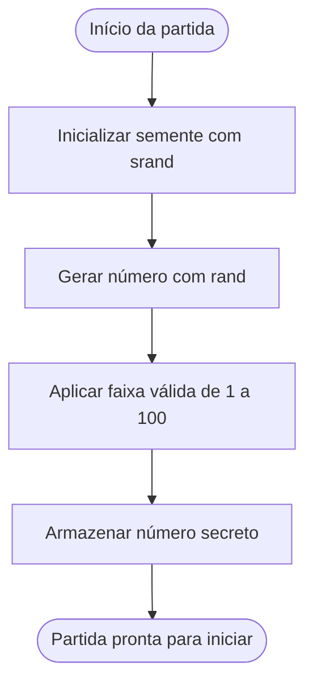
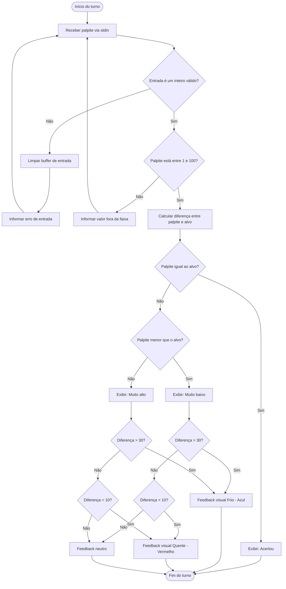
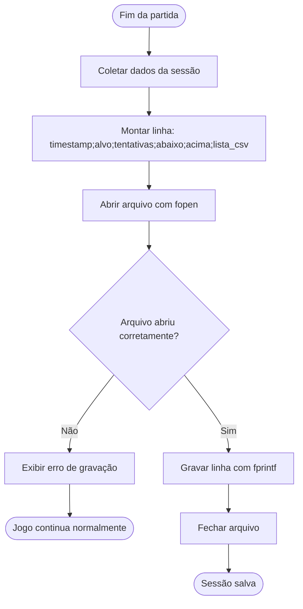
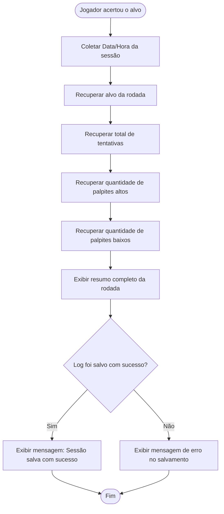
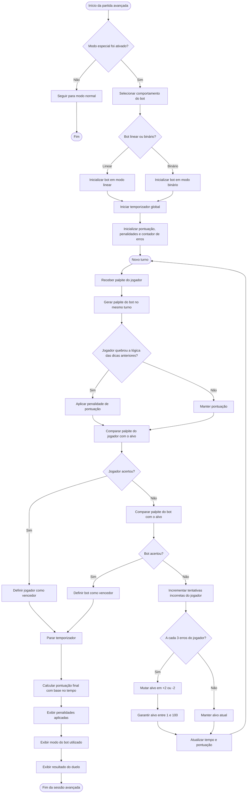

# 🔎 A Saga do Oráculo Numérico

Em um reino distante, onde a magia dos números tece o destino de todos, uma antiga profecia anuncia a chegada do **Oráculo Numérico**, um ser lendário capaz de desvendar os segredos mais profundos do universo através da intuição e da lógica. No entanto, o poder do Oráculo foi fragmentado e espalhado em desafios numéricos por toda a terra, guardados por enigmas e armadilhas.

Você é o **Adivinho Escolhido**, um jovem aspirante a Oráculo, que deve embarcar em uma jornada épica para reunir os fragmentos do poder. Cada partida do jogo é um **Desafio do Destino**, onde você deve decifrar o número secreto que o universo esconde. O sucesso em cada desafio não apenas o aproxima de se tornar o verdadeiro Oráculo, mas também revela novas pistas e aprimora suas habilidades.

Mas a jornada não será fácil. Forças místicas tentarão obscurecer sua mente, e o tempo será seu inimigo. Felizmente, você não está sozinho. **Os Sussurros do Destino** o guiarão com dicas a cada palpite, e os **Pergaminhos do Tempo** registrarão suas vitórias e derrotas, permitindo que você aprenda com o passado. Além disso, a **Sabedoria dos Números** revelará padrões e estratégias, enquanto as **Pistas do Oráculo** sussurrarão conselhos personalizados.

Para auxiliá-lo em sua busca, artefatos mágicos conhecidos como **Toques da Sorte** (os buffs) podem ser encontrados, concedendo-lhe **Imunidade do Oráculo** contra erros ou uma **Segunda Chance do Destino** quando tudo parece perdido. A cada desafio superado, **o Veredito do Tempo** registrará sua glória no ranking dos maiores Adivinhos, e **o Desafio da Perspicácia** se adaptará, tornando sua jornada cada vez mais digna de um verdadeiro Oráculo.

Prepare-se, Adivinho Escolhido! O destino do reino numérico está em suas mãos. Desvende os segredos, domine os números e torne-se o lendário Oráculo Numérico!

---

## 👨‍💻 Equipe

A equipe do **A Saga do Oráculo Numérico** foi organizada de forma colaborativa, distribuindo responsabilidades entre planejamento, prototipação, desenvolvimento, testes e apoio à documentação do projeto.

| Integrante | Função | Descrição |
|---|---|---|
| **Ewerton Guilherme da Silva** | **Product Owner / Desenvolvedor Back-end** | Responsável pela organização das ideias principais do projeto, definição das histórias de usuário e apoio na implementação das regras centrais do jogo, como fases, lógica de progressão e estrutura geral do sistema. |
| **Lauan Gonçalves dos Santos** | **Scrum Master** | Responsável pela organização visual do projeto, protótipos e representação das interfaces e fluxos do jogo, ajudando a planejar a experiência do usuário e a apresentação visual das telas e diagramas. |
| **Davi Magno Campelo do Nascimento** | **Desenvolvedor Front-end** | Responsável pela construção das interações visíveis ao jogador no terminal, incluindo menus, mensagens da partida, exibição de pontuação, feedbacks e organização da navegação do sistema. |
| **Aquiles Pereira dos Santos** | **Testes / QA** | Responsável pela validação das funcionalidades do jogo, identificação de erros e verificação do comportamento esperado das fases, pontuação, ranking e demais mecânicas implementadas. |
| **João Ricardo Alves de Brito** | **Desenvolvedor Back-end** | Responsável pelo apoio na lógica interna do sistema, manipulação de dados do jogo, controle de ranking, armazenamento de informações e funcionamento das regras principais da aplicação. |
| **Mateus Valerino Barros de Santana** | **Desenvolvedor Front-end** | Responsável pelo apoio na construção das telas em terminal, organização da exibição das informações ao jogador e melhoria da experiência durante a execução das fases e eventos do jogo. |
| **Lucas Aprígio dos Santos** | **Desenvolvedor Back-end** | Responsável pelo apoio na implementação das funcionalidades internas do sistema, contribuindo com a lógica das partidas, manipulação de arquivos e estrutura de suporte ao funcionamento do jogo.

---

## 💡 Funcionalidades

O **A Saga do Oráculo Numérico** foi projetado para oferecer uma experiência mais dinâmica e estratégica do que um jogo tradicional de adivinhação, incorporando mecânicas que aumentam o desafio, a progressão e o engajamento do jogador ao longo das partidas.

- 🔢🔮 **Geração de Alvo Aleatório**  
- 🌬️✨ **O Sussurro do Destino**  
- 📜⏳ **O Pergaminho do Tempo**  
- 👁️🧠 **O Olhar do Sábio**  
- 🧮📊 **A Sabedoria dos Números**  
- 📈⚖️ **A Essência da Variância**  
- 🧩🔮 **As Pistas do Oráculo**  
- 🏛️🚪 **O Salão Principal**  
- 📖🏁 **O Epílogo da Jornada**  
- 🔥⚔️ **A Forja dos Campeões**  

## Tela do Kanban

## Ferramentas 

🔗 [Trello](https://trello.com/b/peA1EPFt/projeto-interno)
 

 ## 🔄 Diagrama de Atividades do Sistema

## UH1 - Geração de Alvo Aleatório

---

## UH2 - Validação de Palpites

---

## UH3 - Registro de Partidas

---

## UH4 - Análise de Histórico

---

## UH5 - Métricas Básicas

---

## UH6 - Análise de Performance

---

## UH7 - Dicas Dinâmicas

---

## UH8 - Navegação do Jogo

---

## UH9 - Resumo da Rodada

---

## UH10 - Expansão de Jogo

