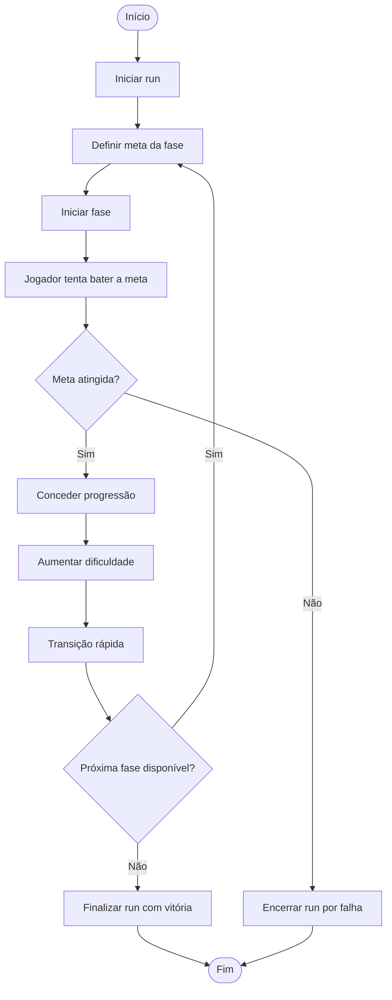
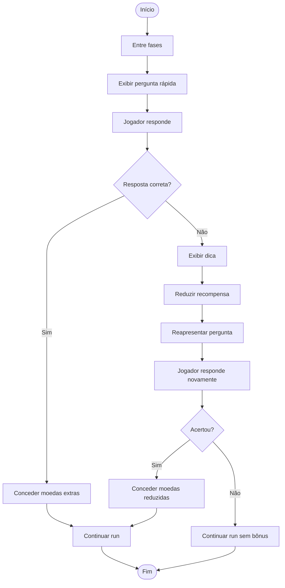
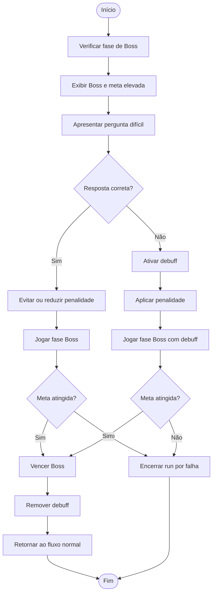
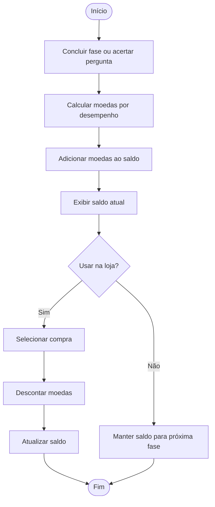
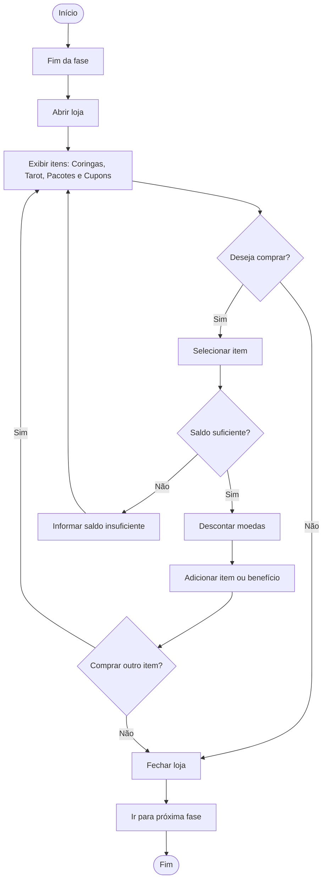
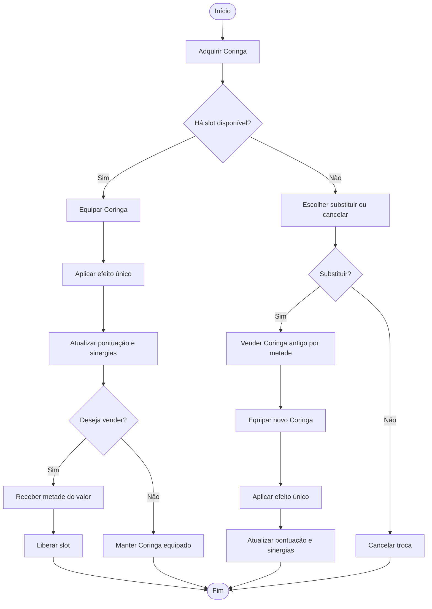
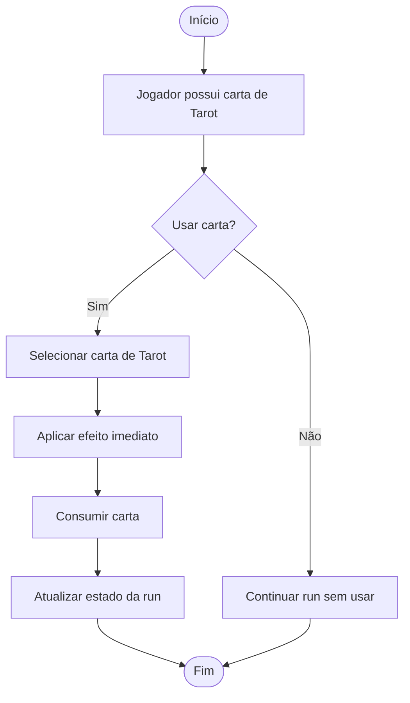
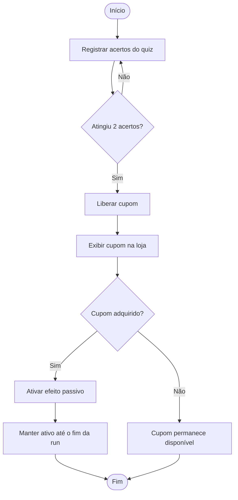
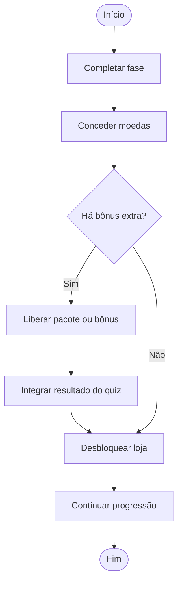
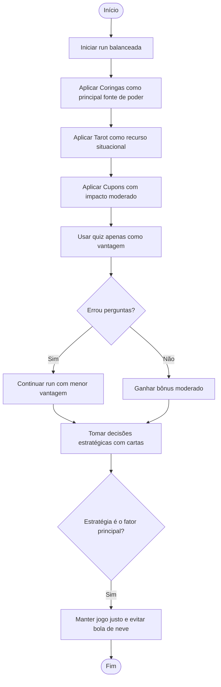

  

O **MetaDeck** é um jogo de cartas estratégico em que o jogador avança por fases cada vez mais desafiadoras, usando combinações, escolhas táticas e adaptação para superar metas de pontuação. Durante a partida, cada decisão influencia diretamente o desempenho, tornando cada rodada única e dinâmica.

A proposta do jogo é oferecer uma experiência envolvente e lúdica, em que estratégia, atenção e criatividade caminham juntas. Com uma atmosfera vibrante e desafios progressivos, o **MetaDeck** estimula o jogador a pensar antes de agir, explorar diferentes possibilidades e buscar a melhor forma de seguir avançando.

---

## 1. Início de Partida

<table>
  <tr>
    <th>Elemento</th>
    <th>Descrição</th>
  </tr>
  <tr>
    <td><strong>Card</strong></td>
    <td>Como jogador, quero jogar cartas para atingir a pontuação da meta e avançar nas fases.</td>
  </tr>
  <tr>
    <td><strong>Conversation</strong></td>
    <td>
      <ul>
        <li>Jogador seleciona cartas da mão</li>
        <li>Sistema reconhece automaticamente a combinação</li>
        <li>Cada jogada gera pontuação base + bônus</li>
        <li>Cartas jogadas só retornam na próxima fase</li>
        <li>Novas cartas são compradas após jogar ou descartar</li>
        <li>Existe limite de mãos e descartes</li>
        <li>Jogador decide entre pontuar ou melhorar a mão</li>
      </ul>
    </td>
  </tr>
  <tr>
    <td><strong>Confirmation</strong></td>
    <td>
      [ ] Seleção e uso de cartas funciona corretamente 
      [ ] Combinações são identificadas corretamente 
      [ ] Pontuação é exibida claramente 
      [ ] Cartas usadas não retornam na mesma fase 
      [ ] Jogador compra novas cartas corretamente 
      [ ] Fase termina ao bater meta ou acabar tentativas
    </td>
  </tr>
</table>

## 2. Sistema de Fases

<table>
  <tr>
    <th>Elemento</th>
    <th>Descrição</th>
  </tr>
  <tr>
    <td><strong>Card</strong></td>
    <td>Como jogador, quero avançar por fases com metas crescentes para sentir progressão.</td>
  </tr>
  <tr>
    <td><strong>Conversation</strong></td>
    <td>
      <ul>
        <li>Cada fase tem uma meta de pontuação</li>
        <li>Dificuldade aumenta gradualmente</li>
        <li>Run continua entre fases</li>
        <li>Falha encerra a run</li>
        <li>Transições são rápidas</li>
      </ul>
    </td>
  </tr>
  <tr>
    <td><strong>Confirmation</strong></td>
    <td>
      [ ] Objetivo é claro 
      [ ] Dificuldade escala corretamente 
      [ ] Progressão é contínua 
      [ ] Falha encerra a run 
      [ ] Jogador sente avanço
    </td>
  </tr>
</table>

## 3. Sistema de Perguntas

<table>
  <tr>
    <th>Elemento</th>
    <th>Descrição</th>
  </tr>
  <tr>
    <td><strong>Card</strong></td>
    <td>Como jogador, quero responder uma pergunta durante a fase para ganhar moedas extras.</td>
  </tr>
  <tr>
    <td><strong>Conversation</strong></td>
    <td>
      <ul>
        <li>Perguntas aparecem entre fases</li>
        <li>Acertos geram moedas</li>
        <li>Erros reaparecem com dica e menor recompensa</li>
        <li>Perguntas são rápidas</li>
        <li>Pode ser múltipla escolha ou aberta</li>
      </ul>
    </td>
  </tr>
  <tr>
    <td><strong>Confirmation</strong></td>
    <td>
      [ ] Perguntas são rápidas e claras 
      [ ] Acertos geram moedas corretamente 
      [ ] Erros reduzem recompensa e dão dica 
      [ ] Sistema não trava o jogo 
      [ ] Jogador não depende do quiz
    </td>
  </tr>
</table>

## 4. BOSS 

<table>
  <tr>
    <th>Elemento</th>
    <th>Descrição</th>
  </tr>
  <tr>
    <td><strong>Card</strong></td>
    <td>Como jogador, quero enfrentar um Boss com desafios difíceis para testar minha estratégia e adaptação.</td>
  </tr>
  <tr>
    <td><strong>Conversation</strong></td>
    <td>
      <ul>
        <li>Boss aparece em fases específicas (ex: a cada X fases)</li>
        <li>Possui meta de pontuação mais alta que fases normais</li>
        <li>Apresenta perguntas mais difíceis</li>
        <li>Erros ativam debuffs na fase atual</li>
        <li>Debuffs podem afetar:
          <ul>
            <li>Pontuação reduzida</li>
            <li>Menos descartes</li>
            <li>Limite de mãos menor</li>
            <li>Penalidades em cartas específicas</li>
          </ul>
        </li>
        <li>Acertos podem evitar ou reduzir penalidades</li>
        <li>Efeito do Boss dura apenas durante a fase</li>
      </ul>
    </td>
  </tr>
  <tr>
    <td><strong>Confirmation</strong></td>
    <td>
      [ ] Boss é claramente identificado como fase especial 
      [ ] Perguntas são mais difíceis que o normal 
      [ ] Erros ativam penalidades visíveis 
      [ ] Debuffs impactam a jogabilidade de forma clara 
      [ ] Jogador consegue vencer mesmo com penalidades (com boa estratégia) 
      [ ] Ao vencer, o jogo retorna ao fluxo normal 
      [ ] Jogador sente aumento real de desafio
    </td>
  </tr>
</table>

## 5. Sistema de Moeda

<table>
  <tr>
    <th>Elemento</th>
    <th>Descrição</th>
  </tr>
  <tr>
    <td><strong>Card</strong></td>
    <td>Como jogador, quero ganhar e gastar moedas para melhorar minha run.</td>
  </tr>
  <tr>
    <td><strong>Conversation</strong></td>
    <td>
      <ul>
        <li>Moedas vêm de fases e perguntas</li>
        <li>Valor varia por desempenho</li>
        <li>Usadas exclusivamente na loja</li>
        <li>Jogador gerencia economia da run</li>
      </ul>
    </td>
  </tr>
  <tr>
    <td><strong>Confirmation</strong></td>
    <td>
      [ ] Moedas são acumuladas corretamente 
      [ ] Interface mostra saldo atual 
      [ ] Gastos são descontados corretamente 
      [ ] Jogador entende como ganhar moedas
    </td>
  </tr>
</table>

## 6. Sistema de Loja

<table>
  <tr>
    <th>Elemento</th>
    <th>Descrição</th>
  </tr>
  <tr>
    <td><strong>Card</strong></td>
    <td>Como jogador, quero usar minhas moedas na loja para fortalecer minha próxima run.</td>
  </tr>
  <tr>
    <td><strong>Conversation</strong></td>
    <td>
      <ul>
        <li>Loja aparece ao fim de cada fase</li>
        <li>Jogador pode comprar:
          <ul>
            <li>Coringas</li>
            <li>Cartas de Tarot</li>
            <li>Pacotes</li>
          </ul>
        </li>
        <li>Pode optar por não comprar</li>
        <li>Itens possuem custo e raridade</li>
        <li>Cupons são liberados via quiz e aparecem aqui</li>
      </ul>
    </td>
  </tr>
  <tr>
    <td><strong>Confirmation</strong></td>
    <td>
      [ ] Loja abre ao fim da fase 
      [ ] Itens são exibidos claramente 
      [ ] Compras funcionam corretamente 
      [ ] Moedas são descontadas 
      [ ] Jogador entende impacto das compras
    </td>
  </tr>
</table>

## 7. Sistema de Pacotes

<table>
  <tr>
    <th>Elemento</th>
    <th>Descrição</th>
  </tr>
  <tr>
    <td><strong>Card</strong></td>
    <td>Como jogador, quero abrir pacotes para escolher entre cartas e montar minha estratégia.</td>
  </tr>
  <tr>
    <td><strong>Conversation</strong></td>
    <td>
      <ul>
        <li>Pacotes oferecem 3 ou 5 opções</li>
        <li>Jogador escolhe uma ou mais cartas</li>
        <li>Pode incluir Coringas ou Tarot</li>
        <li>Introduz RNG controlado</li>
        <li>Ajuda na construção da build</li>
      </ul>
    </td>
  </tr>
  <tr>
    <td><strong>Confirmation</strong></td>
    <td>
      [ ] Pacotes mostram opções corretamente 
      [ ] Jogador consegue escolher 
      [ ] Cartas escolhidas vão para o inventário 
      [ ] Sistema mantém variedade entre runs
    </td>
  </tr>
</table>

## 8. Coringas

<table>
  <tr>
    <th>Elemento</th>
    <th>Descrição</th>
  </tr>
  <tr>
    <td><strong>Card</strong></td>
    <td>Como jogador, quero usar Coringas para aumentar minha pontuação e criar sinergias.</td>
  </tr>
  <tr>
    <td><strong>Conversation</strong></td>
    <td>
      <ul>
        <li>Coringas têm efeitos únicos</li>
        <li>Existe limite de slots</li>
        <li>Afetam diretamente a pontuação</li>
        <li>Podem ser vendidos por metade do valor</li>
        <li>Possuem raridade</li>
      </ul>
    </td>
  </tr>
  <tr>
    <td><strong>Confirmation</strong></td>
    <td>
      [ ] Coringas aplicam efeitos corretamente 
      [ ] Limite de slots funciona 
      [ ] Venda retorna valor correto 
      [ ] Jogador percebe impacto na pontuação 
      [ ] Builds são influenciadas por Coringas
    </td>
  </tr>
</table>

## 9. Cartas de Tarot

<table>
  <tr>
    <th>Elemento</th>
    <th>Descrição</th>
  </tr>
  <tr>
    <td><strong>Card</strong></td>
    <td>Como jogador, quero usar cartas de Tarot para alterar minha run estrategicamente.</td>
  </tr>
  <tr>
    <td><strong>Conversation</strong></td>
    <td>
      <ul>
        <li>Cartas são consumíveis</li>
        <li>Efeitos imediatos</li>
        <li>Uso opcional</li>
        <li>Impacto situacional</li>
      </ul>
    </td>
  </tr>
  <tr>
    <td><strong>Confirmation</strong></td>
    <td>
      [ ] Carta pode ser usada facilmente 
      [ ] Efeito acontece na hora 
      [ ] Carta é consumida 
      [ ] Jogador percebe impacto
    </td>
  </tr>
</table>

## 10. Cupons

<table>
  <tr>
    <th>Elemento</th>
    <th>Descrição</th>
  </tr>
  <tr>
    <td><strong>Card</strong></td>
    <td>Como jogador, quero ganhar cupons para obter vantagens contínuas.</td>
  </tr>
  <tr>
    <td><strong>Conversation</strong></td>
    <td>
      <ul>
        <li>Liberados a cada 2 acertos</li>
        <li>Aparecem na loja</li>
        <li>Efeitos passivos</li>
        <li>Não podem ser removidos</li>
        <li>Impacto moderado</li>
      </ul>
    </td>
  </tr>
  <tr>
    <td><strong>Confirmation</strong></td>
    <td>
      [ ] Cupons são liberados corretamente 
      [ ] Efeitos permanecem ativos 
      [ ] Jogador entende o benefício 
      [ ] Não quebram o balanceamento
    </td>
  </tr>
</table>

## 11. Recompensas de Fase

<table>
  <tr>
    <th>Elemento</th>
    <th>Descrição</th>
  </tr>
  <tr>
    <td><strong>Card</strong></td>
    <td>Como jogador, quero ser recompensado ao completar fases para continuar evoluindo.</td>
  </tr>
  <tr>
    <td><strong>Conversation</strong></td>
    <td>
      <ul>
        <li>Completar fase concede moedas</li>
        <li>Libera acesso à loja</li>
        <li>Pode liberar pacotes ou bônus extras</li>
        <li>Integra com sistema de perguntas</li>
      </ul>
    </td>
  </tr>
  <tr>
    <td><strong>Confirmation</strong></td>
    <td>
      [ ] Jogador recebe moedas ao vencer fase 
      [ ] Loja é desbloqueada 
      [ ] Sistema mantém progressão 
      [ ] Recompensa incentiva continuar
    </td>
  </tr>
</table>

## 12. Integração

<table>
  <tr>
    <th>Elemento</th>
    <th>Descrição</th>
  </tr>
  <tr>
    <td><strong>Card</strong></td>
    <td>Como jogador, quero que o quiz complemente o jogo sem atrapalhar.</td>
  </tr>
  <tr>
    <td><strong>Conversation</strong></td>
    <td>
      <ul>
        <li>Perguntas só entre fases</li>
        <li>Transições rápidas</li>
        <li>Recompensas conectadas à loja</li>
        <li>Loop principal sempre prioridade</li>
      </ul>
    </td>
  </tr>
  <tr>
    <td><strong>Confirmation</strong></td>
    <td>
      [ ] Jogo flui naturalmente 
      [ ] Quiz não interrompe gameplay 
      [ ] Sistemas se conectam bem 
      [ ] Experiência é contínua
    </td>
  </tr>
</table>

## 13. Feedback Visual

<table>
  <tr>
    <th>Elemento</th>
    <th>Descrição</th>
  </tr>
  <tr>
    <td><strong>Card</strong></td>
    <td>Como jogador, quero visualizar claramente pontuação, efeitos e mãos.</td>
  </tr>
  <tr>
    <td><strong>Conversation</strong></td>
    <td>
      <ul>
        <li>Tabela de pontuação das mãos</li>
        <li>Pontuação animada</li>
        <li>Efeitos de Coringas visíveis</li>
        <li>Feedback do quiz</li>
        <li>Interface limpa</li>
      </ul>
    </td>
  </tr>
  <tr>
    <td><strong>Confirmation</strong></td>
    <td>
      [ ] Jogador entende as mãos que podem ser jogadas 
      [ ] Jogador entende ações 
      [ ] Feedback é imediato 
      [ ] Interface não confunde 
      [ ] Informações são claras
    </td>
  </tr>
</table>

## 14. Balanceamento

<table>
  <tr>
    <th>Elemento</th>
    <th>Descrição</th>
  </tr>
  <tr>
    <td><strong>Card</strong></td>
    <td>Como jogador, quero que estratégia com cartas seja mais importante que o quiz.</td>
  </tr>
  <tr>
    <td><strong>Conversation</strong></td>
    <td>
      <ul>
        <li>Coringas são a principal fonte de poder</li>
        <li>Cupons têm impacto moderado</li>
        <li>Tarot é situacional</li>
        <li>Quiz gera vantagem, não vitória</li>
        <li>Evitar “bola de neve”</li>
      </ul>
    </td>
  </tr>
  <tr>
    <td><strong>Confirmation</strong></td>
    <td>
      [ ] Jogador avança mesmo errando perguntas 
      [ ] Coringas têm maior impacto 
      [ ] Cupons não decidem sozinhos 
      [ ] Jogo permanece justo 
      [ ] Estratégia é o fator principal
    </td>
  </tr>
</table>

---

## 👨‍💻 Equipe

A equipe do **Protocolo** foi organizada de forma colaborativa, distribuindo responsabilidades entre planejamento, prototipação, desenvolvimento, testes e apoio à documentação do projeto.

| Integrante | Função | Descrição |
|---|---|---|
| **Ewerton Guilherme da Silva** | **Product Owner / Desenvolvedor Back-end** | Responsável pela organização das ideias principais do projeto, definição das histórias de usuário e apoio na implementação das regras centrais do jogo, como fases, lógica de progressão e estrutura geral do sistema. |
| **Lauan Gonçalves dos Santos** | **Scrum Master** | Responsável pela organização visual do projeto, protótipos e representação das interfaces e fluxos do jogo, ajudando a planejar a experiência do usuário e a apresentação visual das telas e diagramas. |
| **Davi Magno Campelo do Nascimento** | **Desenvolvedor Front-end** | Responsável pela construção das interações visíveis ao jogador no terminal, incluindo menus, mensagens da partida, exibição de pontuação, feedbacks e organização da navegação do sistema. |
| **Aquiles Pereira dos Santos** | **Testes / QA** | Responsável pela validação das funcionalidades do jogo, identificação de erros e verificação do comportamento esperado das fases, pontuação, ranking e demais mecânicas implementadas. |
| **João Ricardo Alves de Brito** | **Desenvolvedor Back-end** | Responsável pelo apoio na lógica interna do sistema, manipulação de dados do jogo, controle de ranking, armazenamento de informações e funcionamento das regras principais da aplicação. |
| **Mateus Valerino Barros de Santana** | **Desenvolvedor Front-end** | Responsável pelo apoio na construção das telas em terminal, organização da exibição das informações ao jogador e melhoria da experiência durante a execução das fases e eventos do jogo. |
| **Lucas Aprígio dos Santos** | **Desenvolvedor Back-end** | Responsável pelo apoio na implementação das funcionalidades internas do sistema, contribuindo com a lógica das partidas, manipulação de arquivos e estrutura de suporte ao funcionamento do jogo.

---

## Tela do Kanban

## Ferramentas 

🔗 [Trello](https://trello.com/b/peA1EPFt/projeto-interno)

### Diagrama de Atividade

## 1 — Início de Partida

## 2 — Sistema de Fases

## 3 — Sistema de Perguntas

## 4 — BOSS 

## 5 — Sistema de Moeda

## 6 — Sistema de Loja

## 7 — Sistema de Pacotes

## 8 — Coringas

## 9 — Cartas de Tarot

## 10 — Cupons

## 11 — Recompensas de Fase

## 12 — Integração

## 13 — Feedback Visual

## 14 — Balanceamento

