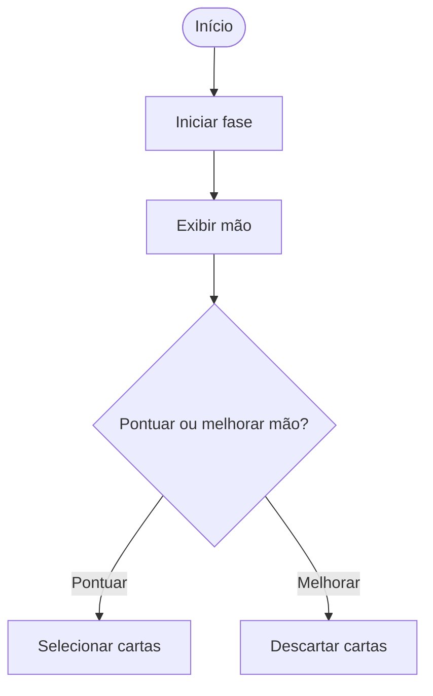
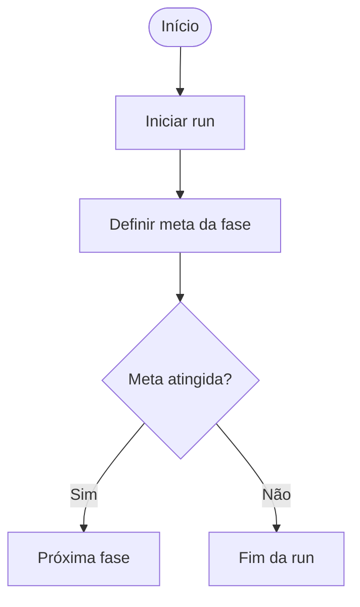

## 👨‍💻 Equipe

A equipe do **Protocolo** foi organizada de forma colaborativa, distribuindo responsabilidades entre planejamento, prototipação, desenvolvimento, testes e apoio à documentação do projeto.

| Integrante | Função | Descrição |
|---|---|---|
| **Ewerton Guilherme da Silva** | **Product Owner / Desenvolvedor Back-end** | Responsável pela organização das ideias principais do projeto, definição das histórias de usuário e apoio na implementação das regras centrais do jogo, como fases, lógica de progressão e estrutura geral do sistema. |
| **Lauan Gonçalves dos Santos** | **Scrum Master** | Responsável pela organização visual do projeto, protótipos e representação das interfaces e fluxos do jogo, ajudando a planejar a experiência do usuário e a apresentação visual das telas e diagramas. |
| **Davi Magno Campelo do Nascimento** | **Desenvolvedor Front-end** | Responsável pela construção das interações visíveis ao jogador no terminal, incluindo menus, mensagens da partida, exibição de pontuação, feedbacks e organização da navegação do sistema. |
| **Aquiles Pereira dos Santos** | **Testes / QA** | Responsável pela validação das funcionalidades do jogo, identificação de erros e verificação do comportamento esperado das fases, pontuação, ranking e demais mecânicas implementadas. |
| **João Ricardo Alves de Brito** | **Desenvolvedor Back-end** | Responsável pelo apoio na lógica interna do sistema, manipulação de dados do jogo, controle de ranking, armazenamento de informações e funcionamento das regras principais da aplicação. |
| **Mateus Valerino Barros de Santana** | **Desenvolvedor Front-end** | Responsável pelo apoio na construção das telas em terminal, organização da exibição das informações ao jogador e melhoria da experiência durante a execução das fases e eventos do jogo. |
| **Lucas Aprígio dos Santos** | **Desenvolvedor Back-end** | Responsável pelo apoio na implementação das funcionalidades internas do sistema, contribuindo com a lógica das partidas, manipulação de arquivos e estrutura de suporte ao funcionamento do jogo.

---

## Tela do Kanban

## Ferramentas 

🔗 [Trello](https://trello.com/b/peA1EPFt/projeto-interno)

### Diagrama de Atividade

## 1 — Início de Partida

## 2 — Sistema de Fases

## 3 — Sistema de Perguntas

## 4 — BOSS 

## 5 — Sistema de Moeda

## 6 — Sistema de Loja

## 7 — Sistema de Pacotes

## 8 — Cartas de Tarot

## 9 — Coringas

## 10 — Cupons

## 11 — Recompensas de Fase

## 12 — Integração

## 13 — Feedback Visual

## 14 — Balanceamento

