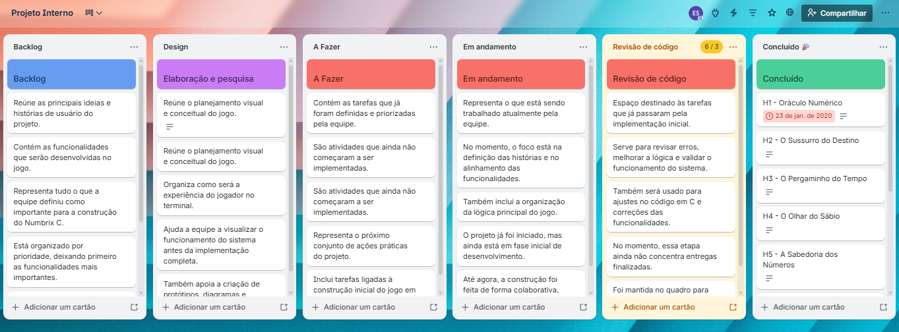
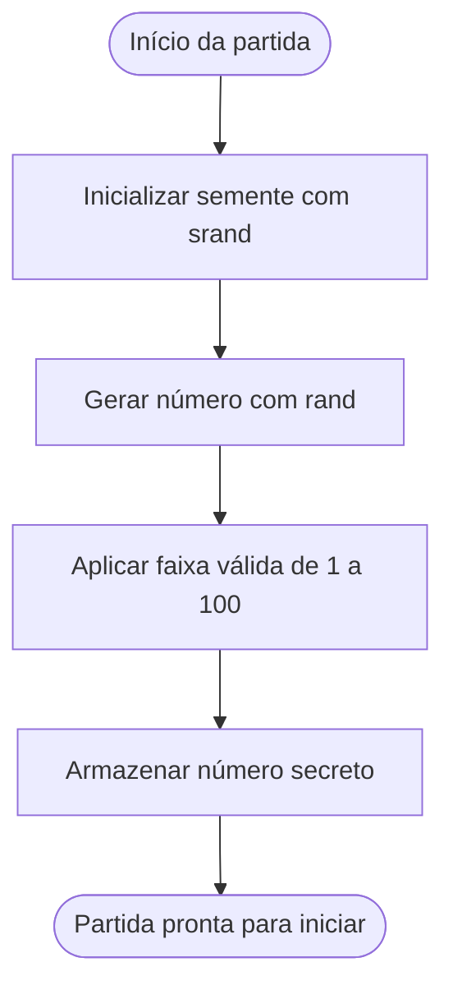
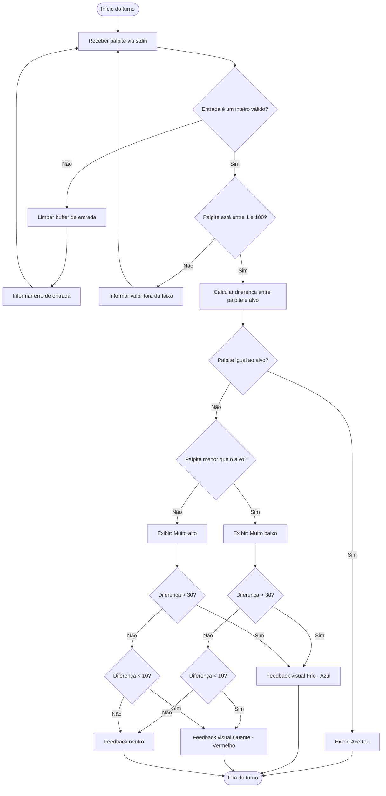
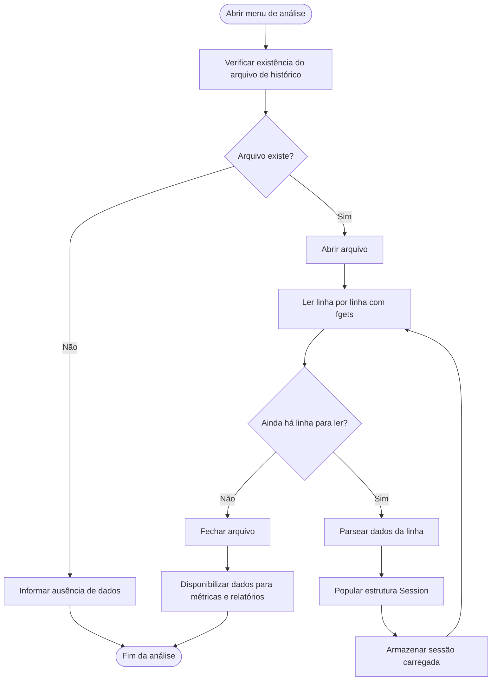
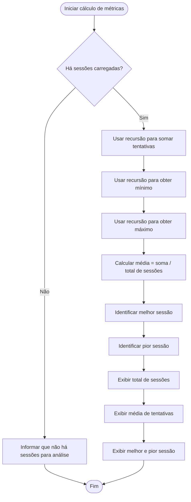
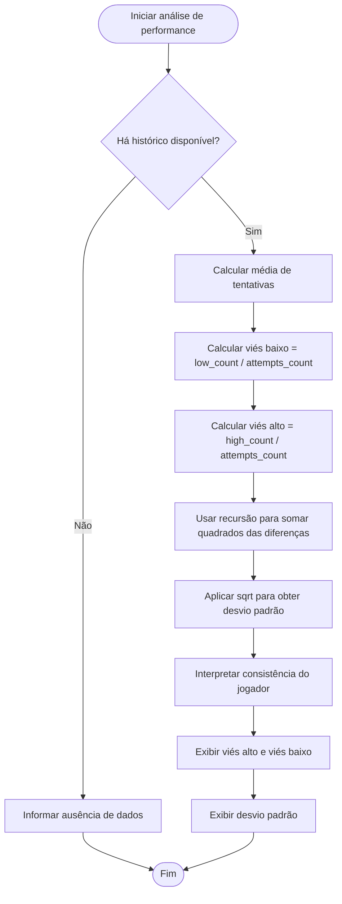
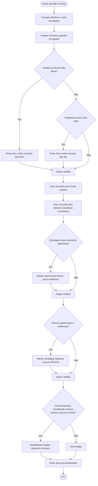
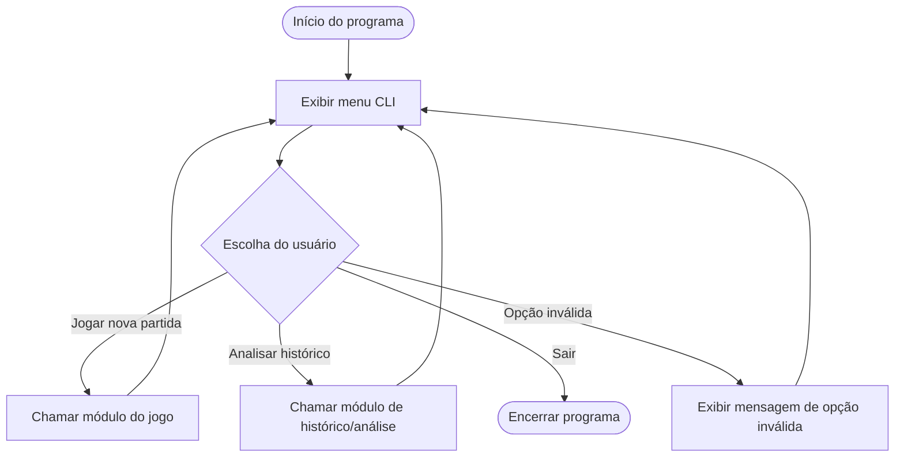

# Protocolo

O jogo se passa em um futuro próximo, onde uma inteligência artificial chamada **Protocolo** monitora e avalia constantemente o comportamento humano. O jogador participa de uma simulação chamada **Protocolo 100**, em que deve descobrir um número oculto entre 1 e 100. Entretanto, o verdadeiro objetivo do sistema não é apenas verificar se o jogador acerta, mas analisar seu raciocínio, sua capacidade de adaptação, sua consistência e a forma como lida com a pressão e com a lógica imposta pela máquina.

Ao longo das partidas, o sistema registra cada tentativa e transforma o histórico do jogador em dados de comportamento. Com base nisso, gera análises, métricas de desempenho e dicas personalizadas, tornando a experiência mais profunda e estratégica. No modo avançado, o jogador enfrenta um bot em tempo real, sob limite de tempo e com a possibilidade de mutações no número-alvo, criando uma atmosfera de instabilidade e tensão.

Com uma estética inspirada em ficção tecnológica e suspense psicológico, o jogo propõe mais do que um simples desafio numérico: ele convida o usuário a enfrentar uma inteligência que aprende com seus erros, corrige seus padrões e transforma cada decisão em evidência. Assim, **Protocolo 100** se apresenta como um jogo moderno, atrativo e inovador, com forte apelo visual e conceitual para diferentes públicos.

---

## 👨‍💻 Equipe

A equipe do **Protocolo** foi organizada de forma colaborativa, distribuindo responsabilidades entre planejamento, prototipação, desenvolvimento, testes e apoio à documentação do projeto.

| Integrante | Função | Descrição |
|---|---|---|
| **Ewerton Guilherme da Silva** | **Product Owner / Desenvolvedor Back-end** | Responsável pela organização das ideias principais do projeto, definição das histórias de usuário e apoio na implementação das regras centrais do jogo, como fases, lógica de progressão e estrutura geral do sistema. |
| **Lauan Gonçalves dos Santos** | **Scrum Master** | Responsável pela organização visual do projeto, protótipos e representação das interfaces e fluxos do jogo, ajudando a planejar a experiência do usuário e a apresentação visual das telas e diagramas. |
| **Davi Magno Campelo do Nascimento** | **Desenvolvedor Front-end** | Responsável pela construção das interações visíveis ao jogador no terminal, incluindo menus, mensagens da partida, exibição de pontuação, feedbacks e organização da navegação do sistema. |
| **Aquiles Pereira dos Santos** | **Testes / QA** | Responsável pela validação das funcionalidades do jogo, identificação de erros e verificação do comportamento esperado das fases, pontuação, ranking e demais mecânicas implementadas. |
| **João Ricardo Alves de Brito** | **Desenvolvedor Back-end** | Responsável pelo apoio na lógica interna do sistema, manipulação de dados do jogo, controle de ranking, armazenamento de informações e funcionamento das regras principais da aplicação. |
| **Mateus Valerino Barros de Santana** | **Desenvolvedor Front-end** | Responsável pelo apoio na construção das telas em terminal, organização da exibição das informações ao jogador e melhoria da experiência durante a execução das fases e eventos do jogo. |
| **Lucas Aprígio dos Santos** | **Desenvolvedor Back-end** | Responsável pelo apoio na implementação das funcionalidades internas do sistema, contribuindo com a lógica das partidas, manipulação de arquivos e estrutura de suporte ao funcionamento do jogo.

---

# Funcionalidades com Nova Temática

A seguir, apresenta-se a lista de funcionalidades reformulada com nomenclaturas mais imersivas e alinhadas à nova temática do jogo.

## UH1 – Inicialização do Protocolo
O sistema ativa a sessão e gera o código oculto que dará início ao teste.

## UH2 – Leitura de Resposta Cognitiva
O jogador insere palpites e recebe feedback imediato do sistema, indicando se sua leitura está acima, abaixo ou próxima do padrão esperado.

## UH3 – Arquivo de Vigilância
Cada partida concluída é registrada automaticamente como um dossiê de comportamento do jogador.

## UH4 – Reconstrução de Perfil
O sistema lê os registros anteriores para montar o histórico analítico das sessões já realizadas.

## UH5 – Painel de Evolução
Exibe o resumo das sessões, média de tentativas, melhor desempenho e pior desempenho do jogador.

## UH6 – Mapa de Tendência Comportamental
Analisa consistência, viés de resposta, impulsividade e padrão de erro com base nas jogadas anteriores.

## UH7 – Interferência Adaptativa da IA
Entrega dicas inteligentes, identifica hábitos repetitivos e reconhece padrões eficientes ou ineficientes do jogador.

## UH8 – Central do Sistema
Menu principal onde o usuário escolhe iniciar nova simulação, acessar análises ou encerrar a execução.

## UH9 – Relatório Pós-Sessão
Ao final da rodada, o sistema apresenta um diagnóstico completo da performance daquela execução.

## UH10 – Modo Ruptura
Modo especial com cronômetro, adversário automático, penalidade lógica, mutação do alvo e disputa direta entre humano e máquina.

---

## Tela do Kanban

## Ferramentas 

🔗 [Trello](https://trello.com/b/peA1EPFt/projeto-interno)
 

 ## 🔄 Diagrama de Atividades do Sistema

## UH1 - Geração de Alvo Aleatório

---

## UH2 - Validação de Palpites

---

## UH3 - Registro de Partidas

---

## UH4 - Análise de Histórico

---

## UH5 - Métricas Básicas

---

## UH6 - Análise de Performance

---

## UH7 - Dicas Dinâmicas

---

## UH8 - Navegação do Jogo

---

## UH9 - Resumo da Rodada

---

## UH10 - Expansão de Jogo

