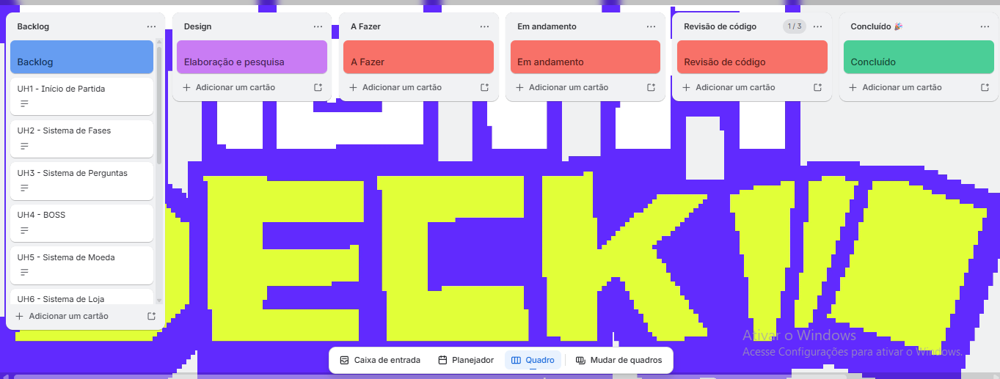

  

O **MetaDeck** é um jogo de cartas estratégico em que o jogador avança por fases cada vez mais desafiadoras, usando combinações, escolhas táticas e adaptação para superar metas de pontuação. Durante a partida, cada decisão influencia diretamente o desempenho, tornando cada rodada única e dinâmica.

A proposta do jogo é oferecer uma experiência envolvente e lúdica, em que estratégia, atenção e criatividade caminham juntas. Com uma atmosfera vibrante e desafios progressivos, o **MetaDeck** estimula o jogador a pensar antes de agir, explorar diferentes possibilidades e buscar a melhor forma de seguir avançando.

---

## Funcionalidade

- **Início de Partida**
- **Sistema de Fases**
- **Sistema de Perguntas**
- **BOSS**
- **Sistema de Moeda**
- **Sistema de Loja**
- **Sistema de Pacotes**
- **Coringas**
- **Cartas de Tarot**
- **Cupons**
- **Recompensas de Fase**
- **Feedback Visual**

---
## Relatorio

[Documentação do Projeto](https://docs.google.com/document/d/1QuwzkYMZ4sQCR2ggyGRRT0ve8KE0VRTHym0jKqX2Nnk/edit?usp=sharing)

---

## Backlog

--- 
## Ferramentas Utilizadas

🔗 [Trello](https://trello.com/b/peA1EPFt/projeto-interno)  
🎨 [Figma](https://www.figma.com/design/ni9lD5vNeYUJGzGCVwKJI0/MetaDeck?node-id=0-1&t=eL88baV89WgyTCQP-1)

---

## Demonstração do Projeto

[🎥 Demonstração do Projeto](https://drive.google.com/file/d/15oD4ilm6bAYJCUN9YIHtGHEEcQMHdxNu/view?usp=drive_link)

---

### Diagrama de Atividade

🔗 [Diagrama](https://www.figma.com/board/oRGYxgpozYA9ofm71KWhNC/Diagrama-de-atividades?node-id=0-1&t=cdALj8wPUNesLKAL-1)

---

## Issue/bug tracker

[Issue/Bug Tracker](https://github.com/egs3-coder/Projeto-Interno/issues)

---

## Programação em Par Experimentada

A equipe utilizou programação par a par para desenvolver, revisar e testar funcionalidades importantes do projeto. A prática ajudou na organização do código, na troca de conhecimento entre os integrantes e na identificação de erros durante o desenvolvimento.

Durante o trabalho em pares, as atividades foram divididas da seguinte forma:

- Um par atuou na lógica interna do jogo, trabalhando na estrutura das rodadas, regras principais e funcionamento das mecânicas do sistema.
- Um par ficou responsável pela interface e experiência do jogador, ajustando telas, menus, mensagens, organização visual e apresentação das informações durante a partida.
- Um par trabalhou na validação das funcionalidades, realizando testes manuais, verificando o comportamento esperado das mecânicas e registrando possíveis bugs ou melhorias.
- Outro par apoiou a organização do projeto, documentação, prototipação e revisão das funcionalidades implementadas.

Com essa prática, enquanto um integrante escrevia ou ajustava o código, o outro acompanhava a lógica, revisava as alterações e sugeria melhorias. Isso contribuiu para um desenvolvimento mais colaborativo, com maior qualidade nas funcionalidades e melhor alinhamento entre as partes do projeto.

---

## Equipe

A equipe do **MetaDeck** foi organizada de forma colaborativa, distribuindo responsabilidades entre planejamento, prototipação, desenvolvimento, testes e apoio à documentação do projeto.

<table>
  <thead>
    <tr>
      <th>Foto</th>
      <th>Integrante</th>
      <th>Função</th>
      <th>Descrição</th>
    </tr>
  </thead>
  <tbody>
    <tr>
      <td align="center">
        
      </td>
      <td><strong>Ewerton Guilherme da Silva</strong></td>
      <td><strong>Desenvolvedor Back-end</strong></td>
      <td>Atuação no planejamento do projeto, organização das ideias principais e contribuição nas decisões relacionadas à estrutura e desenvolvimento do sistema.</td>
    </tr>
    <tr>
      <td align="center">
        
      </td>
      <td><strong>Lauan Gonçalves dos Santos</strong></td>
      <td><strong>Scrum Master</strong></td>
      <td>Responsável pelo apoio à organização visual do projeto, prototipação das telas e representação dos fluxos e interfaces do jogo.</td>
    </tr>
    <tr>
      <td align="center">
        
      </td>
      <td><strong>Davi Magno Campelo do Nascimento</strong></td>
      <td><strong>Desenvolvedor Front-end</strong></td>
      <td>Contribuiu com a construção das interações visíveis ao jogador, organização dos menus, mensagens e navegação do sistema.</td>
    </tr>
    <tr>
      <td align="center">
        
      </td>
      <td><strong>Aquiles Pereira dos Santos</strong></td>
      <td><strong>Testes / QA</strong></td>
      <td>Responsável pela validação das funcionalidades, testes do sistema e verificação do comportamento esperado das mecânicas implementadas.</td>
    </tr>
    <tr>
      <td align="center">
        
      </td>
      <td><strong>João Ricardo Alves de Brito</strong></td>
      <td><strong>Product Owner</strong></td>
      <td>Atuação no apoio à lógica interna da aplicação, organização de dados, regras do sistema e funcionamento das principais mecânicas.</td>
    </tr>
    <tr>
      <td align="center">
        
      </td>
      <td><strong>Mateus Valerino Barros de Santana</strong></td>
      <td><strong>Desenvolvedor Front-end</strong></td>
      <td>Contribuiu com a construção das telas, apresentação das informações ao jogador e melhoria da experiência durante a execução do jogo.</td>
    </tr>
    <tr>
      <td align="center">
        
      </td>
      <td><strong>Lucas Aprígio dos Santos</strong></td>
      <td><strong>Desenvolvedor Back-end</strong></td>
      <td>Apoio na implementação das funcionalidades internas do sistema, estrutura de suporte da aplicação e organização do funcionamento geral do projeto.</td>
    </tr>
  </tbody>
</table>

---

