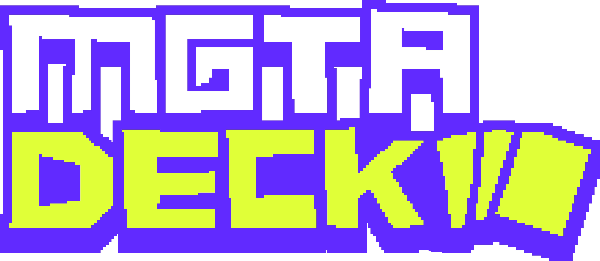
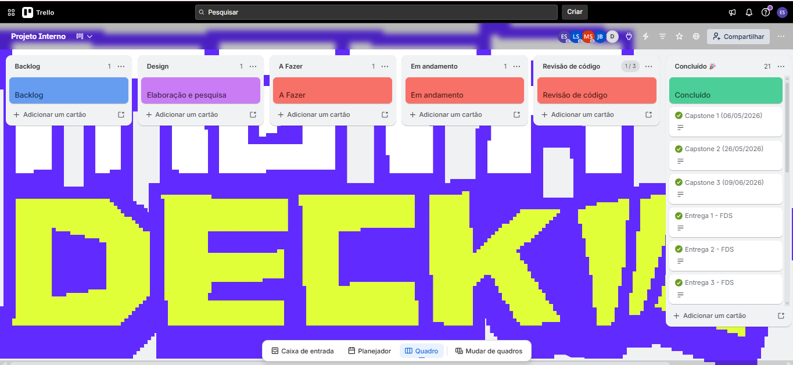
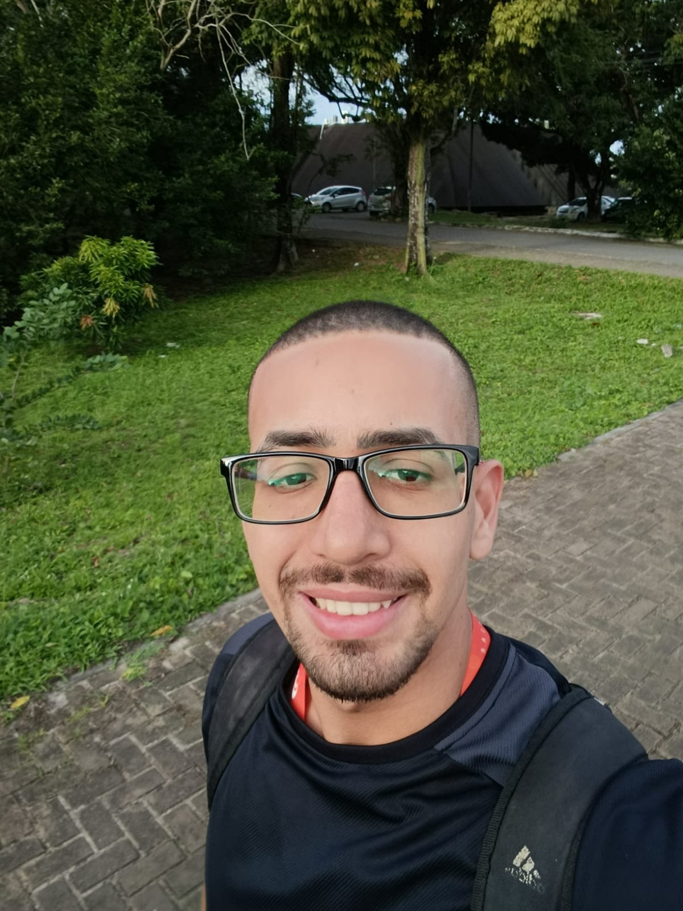
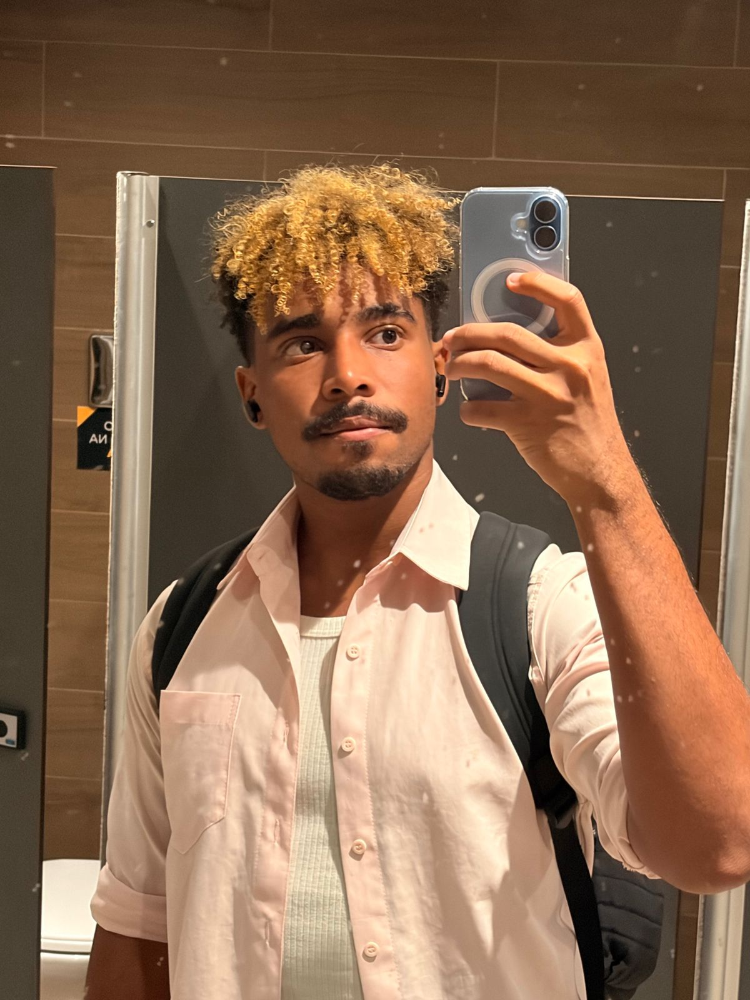
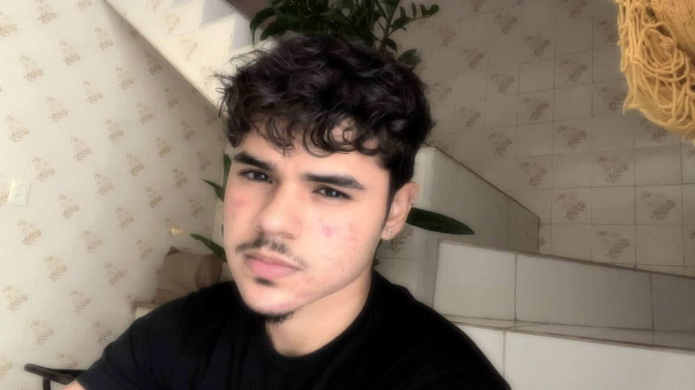
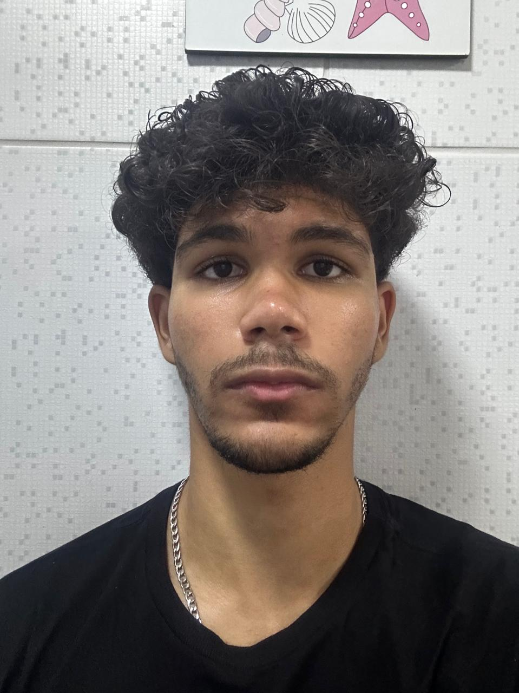
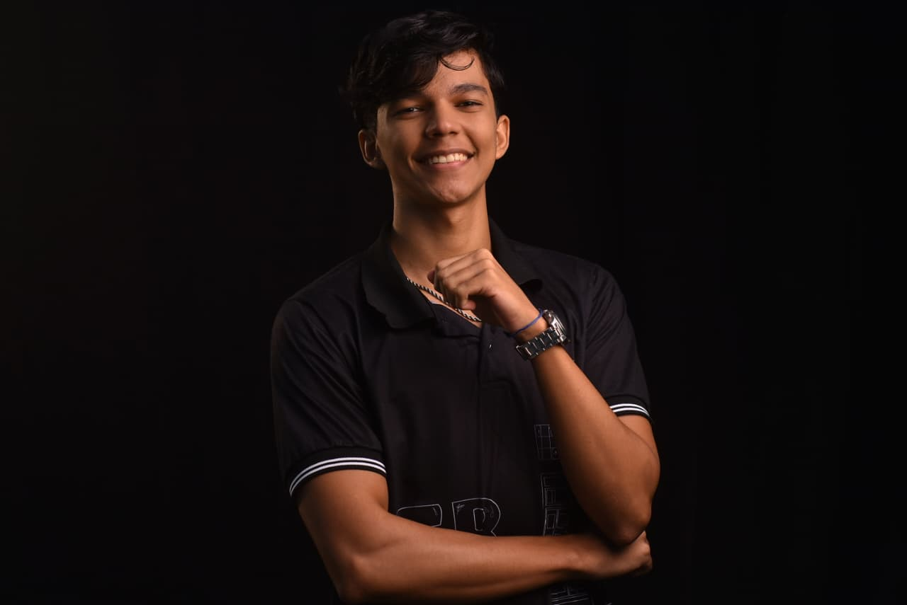
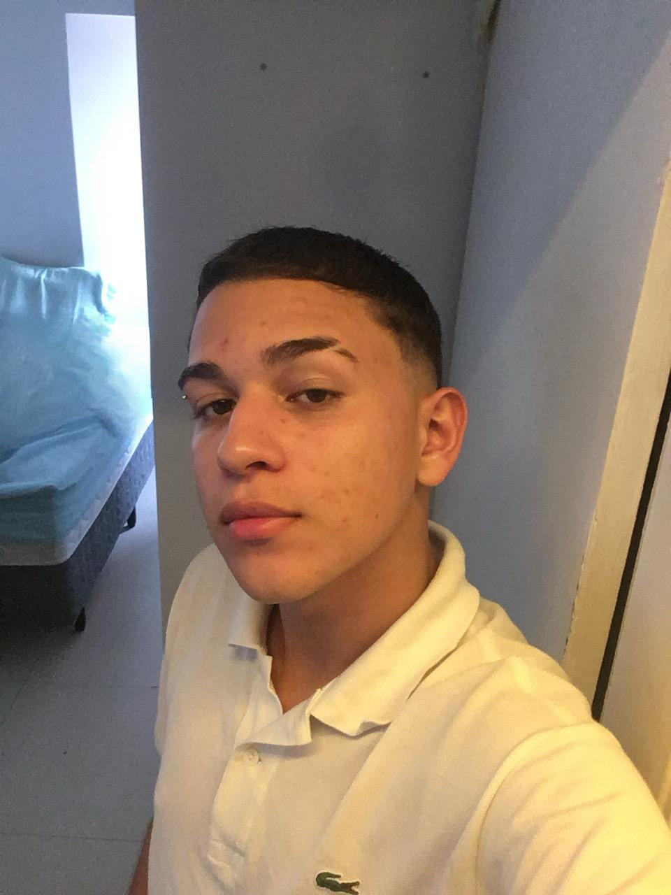
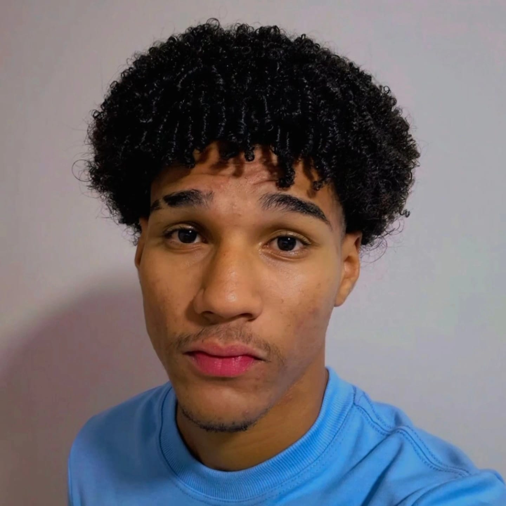

  

O **MetaDeck** é um jogo de cartas estratégico em que o jogador avança por fases cada vez mais desafiadoras, usando combinações, escolhas táticas e adaptação para superar metas de pontuação. Durante a partida, cada decisão influencia diretamente o desempenho, tornando cada rodada única e dinâmica.

A proposta do jogo é oferecer uma experiência envolvente e lúdica, em que estratégia, atenção e criatividade caminham juntas. Com uma atmosfera vibrante e desafios progressivos, o **MetaDeck** estimula o jogador a pensar antes de agir, explorar diferentes possibilidades e buscar a melhor forma de seguir avançando.

---

## Funcionalidades

- **Início de Partida**
- **Sistema de Fases**
- **Sistema de Perguntas**
- **BOSS**
- **Sistema de Moeda**
- **Sistema de Loja**
- **Sistema de Pacotes**
- **Coringas**
- **Cartas de Tarot**
- **Cupons**
- **Recompensas de Fase**
- **Feedback Visual**

---

## Manual do Jogo

[🎮📖 Manual do Jogo](https://lauannoysu.github.io/manual-metadeck/)

---

## Backlog

---

## Quadro do Trello

[🧩 Trello](https://trello.com/b/peA1EPFt/projeto-interno)  

--- 
## Ferramentas Utilizadas

🧩 Trello

🌐 HTML

🎨 CSS

⚙️ JavaScript

💻 Linguagem C

---

## Demonstração do Projeto

[🎥 Demonstração do Projeto](https://drive.google.com/file/d/15oD4ilm6bAYJCUN9YIHtGHEEcQMHdxNu/view?usp=drive_link)

---

## Diagrama de Atividade

 [🗺️ Diagrama](https://www.figma.com/board/oRGYxgpozYA9ofm71KWhNC/Diagrama-de-atividades?node-id=0-1&t=cdALj8wPUNesLKAL-1)

---

## Issue/Bug Tracker

[🐞 Issue/Bug Tracker](https://github.com/egs3-coder/Projeto-Interno/issues)

---

## Programação em Par Experimentada

# Programação em Par Experimentada

Durante o desenvolvimento do projeto **MetaDeck**, a equipe utilizou momentos de **programação em par** como estratégia para melhorar a organização das ideias, revisar decisões técnicas e aumentar a qualidade das funcionalidades implementadas no jogo.

Essa prática foi aplicada principalmente nas histórias de usuário que exigiam maior alinhamento entre lógica do sistema, interface, regras do jogo, economia, loja, cartas especiais, recompensas e testes.

Em alguns momentos, dois integrantes trabalharam juntos em uma mesma funcionalidade, alternando entre quem conduzia a implementação e quem acompanhava, revisava, testava ou sugeria melhorias.

Com isso, foi possível reduzir erros, melhorar a compreensão do código e garantir que mais de uma pessoa entendesse o funcionamento das principais partes do sistema.

---

## Objetivo da Programação em Par

A programação em par foi utilizada com os seguintes objetivos:

- Melhorar a organização das funcionalidades do jogo;
- Revisar decisões técnicas durante o desenvolvimento;
- Aumentar a qualidade das histórias implementadas;
- Facilitar a integração entre front-end, back-end e regras do jogo;
- Reduzir erros durante a construção das funcionalidades;
- Compartilhar conhecimento entre os integrantes da equipe;
- Validar se cada história de usuário estava funcionando corretamente.

---

## Organização das Histórias por Pares

| História | Funcionalidade | Par responsável | Evidência |
|---|---|---|---|
| UH1 | Início de Partida | Ewerton Guilherme da Silva e Lucas Aprígio dos Santos | Imagem 1 |
| UH2 | Sistema de Fases | Ewerton Guilherme da Silva e Lucas Aprígio dos Santos | Imagem 2 |
| UH3 | Sistema de Perguntas | Ewerton Guilherme da Silva e Lucas Aprígio dos Santos | Imagem 3 |
| UH4 | BOSS | Ewerton Guilherme da Silva e Lucas Aprígio dos Santos | Imagem 4 |
| UH5 | Sistema de Moeda | Lauan Gonçalves dos Santos e Ewerton Guilherme da Silva | Imagem 5 |
| UH6 | Sistema de Loja | Lauan Gonçalves dos Santos e Ewerton Guilherme da Silva | Imagem 6 |
| UH7 | Sistema de Pacotes | Ewerton Guilherme da Silva e Mateus Valerino Barros de Santana | Imagem 7 |
| UH8 | Coringas | Ewerton Guilherme da Silva e Mateus Valerino Barros de Santana | Imagem 8 |
| UH9 | Cartas de Tarot | Ewerton Guilherme da Silva e Mateus Valerino Barros de Santana | Imagem 9 |
| UH10 | Cupons | João Ricardo Alves de Brito e Davi Magno Campelo do Nascimento | Imagem 10 |
| UH11 | Recompensas de Fase | João Ricardo Alves de Brito e Davi Magno Campelo do Nascimento | Imagem 11 |
| UH12 | Feedback Visual | João Ricardo Alves de Brito e Davi Magno Campelo do Nascimento | Imagem 12 |
| Validação Geral | Testes e revisão das funcionalidades | Ewerton Guilherme da Silva e Aquiles Pereira dos Santos | Imagens 13 e 14 |

---

# Funcionalidades e Contribuições por História

## UH1 - Início de Partida

**Par responsável:** Ewerton Guilherme da Silva e Lucas Aprígio dos Santos  
**Evidência:** Imagem 1

### Descrição da História

Como jogador, quero jogar cartas para atingir a pontuação da meta e avançar nas fases.

### Atuação do Par

Ewerton Guilherme da Silva e Lucas Aprígio dos Santos trabalharam juntos na organização inicial da lógica da partida.

A dupla atuou na definição de como o jogador inicia a run, seleciona cartas da mão, joga cartas para obter pontuação e continua o progresso dentro do jogo.

Essa colaboração foi importante para criar a base principal da partida, incluindo o controle das cartas disponíveis, a pontuação obtida por jogada e o comportamento do sistema após o jogador jogar ou descartar cartas.

### Contribuições Realizadas

- Organização da lógica inicial da partida;
- Definição do funcionamento das cartas na mão;
- Controle das jogadas realizadas pelo jogador;
- Estruturação da pontuação obtida nas combinações;
- Apoio à integração da primeira funcionalidade com as fases seguintes.

---

## UH2 - Sistema de Fases

**Par responsável:** Ewerton Guilherme da Silva e Lucas Aprígio dos Santos  
**Evidência:** Imagem 2

### Descrição da História

Como jogador, quero avançar por fases com metas crescentes para sentir progresso.

### Atuação do Par

Nessa história, Ewerton e Lucas trabalharam na lógica de avanço entre fases.

A dupla analisou como o sistema deveria verificar se o jogador atingiu a meta de pontuação, como a dificuldade aumentaria gradualmente e como a run continuaria após a conclusão de uma fase.

A programação em par ajudou a revisar as regras de progressão, garantindo que o jogador só avançasse quando cumprisse o objetivo definido.

### Contribuições Realizadas

- Definição das metas de pontuação por fase;
- Organização do avanço entre fases;
- Revisão do aumento gradual de dificuldade;
- Validação das condições de sucesso e falha;
- Estruturação da continuidade da run.

---

## UH3 - Sistema de Perguntas

**Par responsável:** Ewerton Guilherme da Silva e Lucas Aprígio dos Santos  
**Evidência:** Imagem 3

### Descrição da História

Como jogador, quero responder uma pergunta durante a fase para ganhar moedas extras.

### Atuação do Par

Ewerton e Lucas trabalharam juntos na organização da mecânica de perguntas entre fases.

A dupla alinhou a lógica para exibição das perguntas, validação das respostas e geração de moedas extras em caso de acerto.

Também foi analisado o comportamento em caso de erro, considerando o reaparecimento da pergunta com dica e uma recompensa menor.

Essa colaboração ajudou a integrar o sistema de perguntas com a economia do jogo.

### Contribuições Realizadas

- Organização da exibição das perguntas;
- Validação das respostas do jogador;
- Definição da recompensa em moedas;
- Tratamento de erros com dica e menor recompensa;
- Integração entre perguntas e sistema de moedas.

---

## UH4 - BOSS

**Par responsável:** Ewerton Guilherme da Silva e Lucas Aprígio dos Santos  
**Evidência:** Imagem 4

### Descrição da História

Como jogador, quero enfrentar um Boss com desafios difíceis para testar minha estratégia e adaptação.

### Atuação do Par

O par atuou na definição das regras do Boss, responsável por criar momentos de maior dificuldade durante a run.

Ewerton e Lucas trabalharam na lógica de fases especiais, nas metas de pontuação mais altas e na aplicação de debuffs em caso de erro.

A programação em par foi importante para equilibrar o desafio, revisar as condições de vitória e falha e garantir que o Boss tivesse impacto real na estratégia do jogador.

### Contribuições Realizadas

- Definição das fases em que o Boss aparece;
- Organização da meta de pontuação especial;
- Implementação da lógica de desafios mais difíceis;
- Aplicação de debuffs durante a fase;
- Revisão do impacto do Boss na estratégia do jogador.

---

## UH5 - Sistema de Moeda

**Par responsável:** Lauan Gonçalves dos Santos e Ewerton Guilherme da Silva  
**Evidência:** Imagem 5

### Descrição da História

Como jogador, quero ganhar e gastar moedas para melhorar minha run.

### Atuação do Par

Lauan e Ewerton colaboraram na organização do sistema de moedas do jogo.

Ewerton contribuiu com a lógica de acúmulo e funcionamento interno das moedas, enquanto Lauan apoiou a organização visual e a clareza do fluxo para o jogador.

A dupla ajudou a garantir que o saldo fosse atualizado corretamente e apresentado de forma compreensível na interface.

### Contribuições Realizadas

- Definição das formas de ganhar moedas;
- Organização do saldo do jogador;
- Atualização correta das moedas durante a run;
- Integração das moedas com perguntas e fases;
- Apoio à visualização do saldo na interface.

---

## UH6 - Sistema de Loja

**Par responsável:** Lauan Gonçalves dos Santos e Ewerton Guilherme da Silva  
**Evidência:** Imagem 6

### Descrição da História

Como jogador, quero usar minhas moedas na loja para fortalecer minha próxima run.

### Atuação do Par

Nessa história, Lauan e Ewerton trabalharam na estrutura da loja, que aparece ao final de cada fase.

A dupla alinhou quais itens poderiam ser comprados, como Coringas, Cartas de Tarot e Pacotes, além da possibilidade de o jogador optar por não comprar nada.

A programação em par ajudou a revisar a relação entre moedas, itens disponíveis, custo e raridade.

### Contribuições Realizadas

- Organização da loja ao final das fases;
- Definição dos itens disponíveis para compra;
- Integração da loja com o sistema de moedas;
- Organização de custos e raridades;
- Apoio à experiência visual da loja.

---

## UH7 - Sistema de Pacotes

**Par responsável:** Ewerton Guilherme da Silva e Mateus Valerino Barros de Santana  
**Evidência:** Imagem 7

### Descrição da História

Como jogador, quero abrir pacotes para escolher entre cartas e montar minha estratégia.

### Atuação do Par

Ewerton e Mateus atuaram juntos na funcionalidade de pacotes.

Ewerton apoiou a lógica de escolha e controle das opções apresentadas, enquanto Mateus contribuiu com a apresentação visual e a experiência do jogador.

A colaboração foi importante para organizar o processo de abertura dos pacotes, a escolha das cartas e a integração com a construção da build.

### Contribuições Realizadas

- Definição da abertura de pacotes;
- Organização das opções apresentadas ao jogador;
- Controle da escolha de uma ou mais cartas;
- Integração dos pacotes com Coringas e Tarot;
- Apoio à construção estratégica da build.

---

## UH8 - Coringas

**Par responsável:** Ewerton Guilherme da Silva e Mateus Valerino Barros de Santana  
**Evidência:** Imagem 8

### Descrição da História

Como jogador, quero usar Coringas para aumentar minha pontuação e criar sinergias.

### Atuação do Par

O par trabalhou na mecânica dos Coringas, que possuem efeitos únicos e impactam diretamente a pontuação.

Ewerton e Mateus revisaram a aplicação dos efeitos, o limite de slots, a raridade e a possibilidade de venda por metade do valor.

A programação em par ajudou a alinhar a lógica da funcionalidade com a forma como essas informações seriam exibidas ao jogador.

### Contribuições Realizadas

- Definição dos efeitos dos Coringas;
- Organização do limite de slots;
- Aplicação dos efeitos na pontuação;
- Definição de raridade;
- Implementação da possibilidade de venda.

---

## UH9 - Cartas de Tarot

**Par responsável:** Ewerton Guilherme da Silva e Mateus Valerino Barros de Santana  
**Evidência:** Imagem 9

### Descrição da História

Como jogador, quero usar cartas de Tarot para alterar minha run estrategicamente.

### Atuação do Par

Nessa história, Ewerton e Mateus colaboraram na construção da mecânica das Cartas de Tarot.

O par analisou o uso consumível das cartas, seus efeitos imediatos e o impacto situacional durante a run.

A dupla também revisou a forma como o jogador utilizaria essas cartas, buscando deixar a funcionalidade simples, estratégica e compreensível dentro da interface.

### Contribuições Realizadas

- Definição do uso consumível das cartas;
- Organização dos efeitos imediatos;
- Revisão do impacto estratégico na run;
- Integração das cartas com a loja e pacotes;
- Apoio à clareza da interface para uso das cartas.

---

## UH10 - Cupons

**Par responsável:** João Ricardo Alves de Brito e Davi Magno Campelo do Nascimento  
**Evidência:** Imagem 10

### Descrição da História

Como jogador, quero ganhar cupons para obter vantagens contínuas.

### Atuação do Par

João Ricardo e Davi trabalharam juntos na funcionalidade de Cupons.

João contribuiu com a visão das regras e do impacto dos cupons na mecânica geral do jogo, enquanto Davi colaborou na parte visual e nas interações apresentadas ao jogador.

A programação em par ajudou a definir quando os cupons seriam liberados, como apareceriam na loja e como seus efeitos permaneceriam ativos.

### Contribuições Realizadas

- Definição da liberação de cupons;
- Organização dos efeitos passivos;
- Integração dos cupons com a loja;
- Revisão do impacto moderado dos benefícios;
- Apoio à apresentação dos cupons na interface.

---

## UH11 - Recompensas de Fase

**Par responsável:** João Ricardo Alves de Brito e Davi Magno Campelo do Nascimento  
**Evidência:** Imagem 11

### Descrição da História

Como jogador, quero ser recompensado ao completar fases para continuar evoluindo.

### Atuação do Par

O par atuou na organização das recompensas concedidas ao jogador ao completar fases.

João ajudou a validar as regras de negócio, definindo o que o jogador deveria receber ao vencer uma fase, enquanto Davi contribuiu com a apresentação dessas recompensas na interface.

Essa colaboração foi importante para integrar moedas, acesso à loja, pacotes e bônus extras ao fluxo de progressão do jogo.

### Contribuições Realizadas

- Definição das recompensas ao concluir fases;
- Liberação da loja após completar fase;
- Integração com moedas e bônus extras;
- Organização da progressão do jogador;
- Apoio à exibição das recompensas na interface.

---

## UH12 - Feedback Visual

**Par responsável:** João Ricardo Alves de Brito e Davi Magno Campelo do Nascimento  
**Evidência:** Imagem 12

### Descrição da História

Como jogador, quero visualizar claramente pontuação, efeitos e mãos.

### Atuação do Par

João e Davi colaboraram na melhoria do feedback visual do jogo.

O foco dessa história foi deixar claras as informações de pontuação, efeitos ativos, mãos disponíveis e resultados das ações do jogador.

A programação em par ajudou a tornar a interface mais limpa, compreensível e adequada para acompanhar o progresso da run.

### Contribuições Realizadas

- Organização da tabela de pontuação das mãos;
- Melhoria da exibição da pontuação;
- Representação visual dos efeitos de Coringas;
- Feedback das respostas do quiz;
- Revisão da clareza geral da interface.

---

# Validação Geral do Projeto

## Testes e Revisão das Funcionalidades

**Par responsável:** Ewerton Guilherme da Silva e Aquiles Pereira dos Santos  
**Evidências:** Imagens 13 e 14

### Atuação do Par

Ewerton e Aquiles atuaram na revisão geral das funcionalidades implementadas.

Aquiles contribuiu com a parte de testes e validação das mecânicas, analisando possíveis falhas, inconsistências e problemas durante a execução do jogo.

Ewerton apoiou a correção, revisão técnica e verificação das funcionalidades relacionadas às histórias de usuário.

Esse par foi importante para garantir que o sistema estivesse coerente com a proposta do MetaDeck e que as histórias funcionassem conforme o comportamento esperado.

### Contribuições Realizadas

- Testes das funcionalidades implementadas;
- Validação do comportamento esperado do jogo;
- Identificação de possíveis falhas;
- Revisão das histórias de usuário;
- Apoio à correção e melhoria das funcionalidades.

---

# Justificativa da Organização do Trabalho

A equipe do projeto **MetaDeck** possui integrantes com funções diferentes, incluindo desenvolvedores back-end, desenvolvedores front-end, Scrum Master, Product Owner e responsável por testes/QA.

Por esse motivo, nem todas as atividades foram realizadas por duplas fixas durante todo o desenvolvimento. A equipe organizou a programação em par de acordo com a necessidade de cada história de usuário.

As primeiras histórias, relacionadas ao início da partida, fases, perguntas e Boss, exigiram maior atenção à lógica interna do jogo. Por isso, foram trabalhadas por **Ewerton Guilherme da Silva e Lucas Aprígio dos Santos**.

As histórias relacionadas à moeda e loja exigiram integração entre lógica do sistema e organização visual. Por isso, foram trabalhadas por **Lauan Gonçalves dos Santos e Ewerton Guilherme da Silva**.

As histórias de pacotes, Coringas e Cartas de Tarot envolveram tanto lógica de efeitos e escolhas quanto apresentação visual desses elementos. Por isso, foram trabalhadas por **Ewerton Guilherme da Silva e Mateus Valerino Barros de Santana**.

As histórias de Cupons, Recompensas de Fase e Feedback Visual foram desenvolvidas por **João Ricardo Alves de Brito e Davi Magno Campelo do Nascimento**, combinando a visão das regras do jogo com a construção de uma interface mais clara para o jogador.

Por fim, **Ewerton Guilherme da Silva e Aquiles Pereira dos Santos** atuaram na validação geral, realizando testes e verificando se as funcionalidades estavam funcionando conforme o esperado.

Além dos momentos em dupla, a equipe também realizou alinhamentos presenciais em sala de aula, com a participação de vários integrantes, para discutir problemas, revisar decisões e acompanhar o andamento do projeto.

Quando não era possível reunir todos presencialmente, o grupo utilizava o WhatsApp para trocar informações, enviar atualizações, combinar tarefas e discutir ajustes necessários.

Dessa forma, a programação em par foi utilizada como uma estratégia de colaboração aplicada nas partes mais importantes do projeto, ajudando a melhorar a qualidade das entregas, reduzir erros, compartilhar conhecimento entre os membros e garantir que as funcionalidades do **MetaDeck** fossem desenvolvidas de forma mais organizada.

---

## Fotos do Processo Par a Par 

[📸 Par a Par](https://drive.google.com/drive/folders/1xUZnOHY5zDmLfqT6EI7P3UUF10MiQUGF?usp=drive_link)

---

## O que aprendemos com essa prática

A experiência com programação em par mostrou que o trabalho colaborativo ajuda bastante na identificação de problemas e na melhoria da qualidade do projeto. Quando duas pessoas analisam a mesma funcionalidade, fica mais fácil perceber erros de lógica, falhas na interface, problemas de organização ou comportamentos inesperados durante a execução do sistema.

Também percebemos que a comunicação entre os integrantes é essencial para que o projeto avance de forma organizada. Como a equipe possui membros com rotinas diferentes, foi necessário planejar melhor os momentos de reunião, dividir responsabilidades e utilizar encontros remotos quando não era possível reunir todos presencialmente.

Outro aprendizado importante foi entender que o trabalho em equipe não depende apenas de todos estarem presentes ao mesmo tempo. Mesmo com limitações de horário, estágios, trabalho, compromissos pessoais e participação remota de alguns integrantes, foi possível manter a colaboração por meio de revisões, testes, troca de ideias e acompanhamento das funcionalidades desenvolvidas.

A programação em par contribuiu para que o projeto tivesse uma construção mais segura, pois as funcionalidades passaram por mais de uma análise antes de serem consideradas finalizadas. Isso fortaleceu a integração entre front-end, back-end, testes e organização geral do sistema, além de permitir que os integrantes compreendessem melhor o funcionamento completo do jogo.

---

## Equipe

A equipe do **MetaDeck** foi organizada de forma colaborativa, distribuindo responsabilidades entre planejamento, prototipação, desenvolvimento, testes e apoio à documentação do projeto.

<table>
  <thead>
    <tr>
      <th>Foto</th>
      <th>Integrante</th>
      <th>Função</th>
      <th>Descrição</th>
    </tr>
  </thead>
  <tbody>
    <tr>
      <td align="center">
        
      </td>
      <td><strong>Ewerton Guilherme da Silva</strong></td>
      <td><strong>Desenvolvedor Back-end</strong></td>
      <td>Atuação no planejamento do projeto, organização das ideias principais e contribuição nas decisões relacionadas à estrutura e desenvolvimento do sistema.</td>
    </tr>
    <tr>
      <td align="center">
        
      </td>
      <td><strong>Lauan Gonçalves dos Santos</strong></td>
      <td><strong>Scrum Master</strong></td>
      <td>Responsável pelo apoio à organização visual do projeto, prototipação das telas e representação dos fluxos e interfaces do jogo.</td>
    </tr>
    <tr>
      <td align="center">
        
      </td>
      <td><strong>Davi Magno Campelo do Nascimento</strong></td>
      <td><strong>Desenvolvedor Front-end</strong></td>
      <td>Contribuiu com a construção das interações visíveis ao jogador, organização dos menus, mensagens e navegação do sistema.</td>
    </tr>
    <tr>
      <td align="center">
        
      </td>
      <td><strong>Aquiles Pereira dos Santos</strong></td>
      <td><strong>Testes / QA</strong></td>
      <td>Responsável pela validação das funcionalidades, testes do sistema e verificação do comportamento esperado das mecânicas implementadas.</td>
    </tr>
    <tr>
      <td align="center">
        
      </td>
      <td><strong>João Ricardo Alves de Brito</strong></td>
      <td><strong>Product Owner</strong></td>
      <td>Atuação no apoio à lógica interna da aplicação, organização de dados, regras do sistema e funcionamento das principais mecânicas.</td>
    </tr>
    <tr>
      <td align="center">
        
      </td>
      <td><strong>Mateus Valerino Barros de Santana</strong></td>
      <td><strong>Desenvolvedor Front-end</strong></td>
      <td>Contribuiu com a construção das telas, apresentação das informações ao jogador e melhoria da experiência durante a execução do jogo.</td>
    </tr>
    <tr>
      <td align="center">
        
      </td>
      <td><strong>Lucas Aprígio dos Santos</strong></td>
      <td><strong>Desenvolvedor Back-end</strong></td>
      <td>Apoio na implementação das funcionalidades internas do sistema, estrutura de suporte da aplicação e organização do funcionamento geral do projeto.</td>
    </tr>
  </tbody>
</table>

---
