

  

O **MetaDeck** é um jogo de cartas estratégico em que o jogador avança por fases cada vez mais desafiadoras, usando combinações, escolhas táticas e adaptação para superar metas de pontuação. Durante a partida, cada decisão influencia diretamente o desempenho, tornando cada rodada única e dinâmica.

A proposta do jogo é oferecer uma experiência envolvente e lúdica, em que estratégia, atenção e criatividade caminham juntas. Com uma atmosfera vibrante e desafios progressivos, o **MetaDeck** estimula o jogador a pensar antes de agir, explorar diferentes possibilidades e buscar a melhor forma de seguir avançando.

---

## Funcionalidades

- **Início de Partida**
- **Sistema de Fases**
- **Sistema de Perguntas**
- **BOSS**
- **Sistema de Moeda**
- **Sistema de Loja**
- **Sistema de Pacotes**
- **Coringas**
- **Cartas de Tarot**
- **Cupons**
- **Recompensas de Fase**
- **Feedback Visual**

---

## Relatório

[Documentação do Projeto](https://docs.google.com/document/d/1QuwzkYMZ4sQCR2ggyGRRT0ve8KE0VRTHym0jKqX2Nnk/edit?usp=sharing)

---

## Backlog

---

## Ferramentas Utilizadas

🔗 [Trello](https://trello.com/b/peA1EPFt/projeto-interno)  
🎨 [Figma](https://www.figma.com/design/ni9lD5vNeYUJGzGCVwKJI0/MetaDeck?node-id=0-1&t=eL88baV89WgyTCQP-1)

---

## Demonstração do Projeto

[🎥 Demonstração do Projeto](https://drive.google.com/file/d/15oD4ilm6bAYJCUN9YIHtGHEEcQMHdxNu/view?usp=drive_link)

---

### Diagrama de Atividade

🔗 [Diagrama](https://www.figma.com/board/oRGYxgpozYA9ofm71KWhNC/Diagrama-de-atividades?node-id=0-1&t=cdALj8wPUNesLKAL-1)

---

## Issue/Bug Tracker

[Issue/Bug Tracker](https://github.com/egs3-coder/Projeto-Interno/issues)

---

## Programação em Par Experimentada

### Relato de Programação Par a Par — MetaDeck

### Visão Geral

Durante o desenvolvimento do **MetaDeck**, a equipe utilizou a prática de **programação par a par**, em que os integrantes trabalharam em duplas ou em ligação direta com outras funções do time. Essa organização ajudou no desenvolvimento das funcionalidades, na validação das telas, nos testes e na documentação do projeto.

### Resumo da Programação Par a Par

| Par | Integrantes | Área principal | Principais entregas |
| :--- | :--- | :--- | :--- |
| Par 1 | Ewerton e Lucas | Back-end | Partida, fases, perguntas, Boss, moedas, cartas especiais e recompensas |
| Par 2 | Mateus e Davi | Front-end | Menu, perfil, partida, loja, coleção, perguntas, ranking, histórico e telas finais |
| Par 3 | Lauan e Aquiles | Gestão e QA | Organização, acompanhamento, testes, validação de fluxo e identificação de melhorias |
| Produto | João Ricardo com os pares | Product Owner | Validação da proposta, experiência do jogador e priorização das funcionalidades |

### Par 1 — Back-end

| Integrantes | Área de atuação |
| :--- | :--- |
| Ewerton Guilherme da Silva e Lucas Aprígio dos Santos | Lógica da partida, perguntas, fases, Boss e cartas especiais |

#### Atuação do par

Ewerton e Lucas atuaram juntos na construção da lógica principal do jogo.  
Ewerton ficou mais responsável pela parte de **início de partida, sistema de fases, pontuação, moedas e recompensas de fase**. Lucas atuou mais diretamente no **sistema de perguntas, Boss, coringas, cartas de tarot, cupons e integração dos efeitos especiais com a partida**.

A atuação em par foi importante porque as funcionalidades dependiam uma da outra. Por exemplo, as perguntas e o Boss interferem diretamente no andamento da run, enquanto o sistema de moedas e recompensas influencia a loja e a compra de cartas especiais.

#### Funcionalidadess relacionadas

| Funcionalidade | Responsável principal |
| :--- | :--- |
| Início de Partida | Ewerton |
| Sistema de Fases | Ewerton |
| Sistema de Moeda | Ewerton |
| Recompensas de Fase | Ewerton |
| Sistema de Perguntas | Lucas |
| BOSS | Lucas |
| Coringas | Lucas |
| Cartas de Tarot | Lucas |
| Cupons | Lucas |

#### Telas relacionadas

  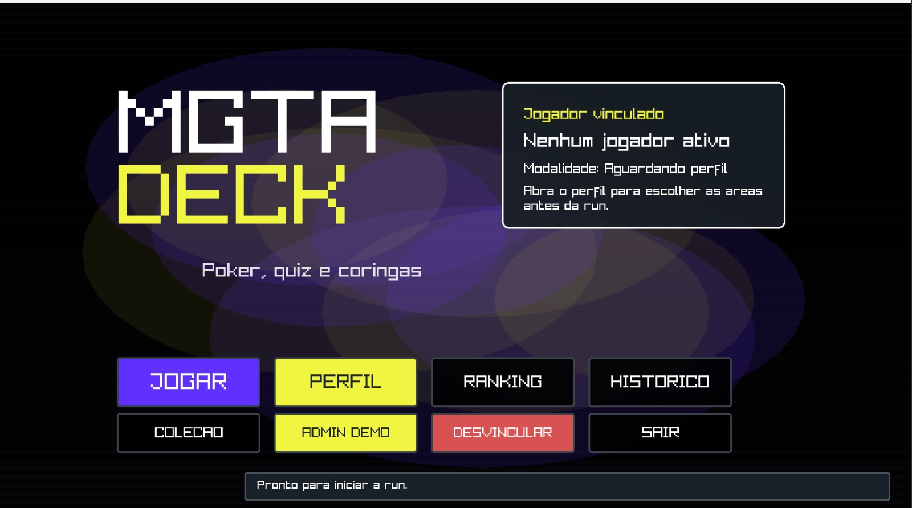

  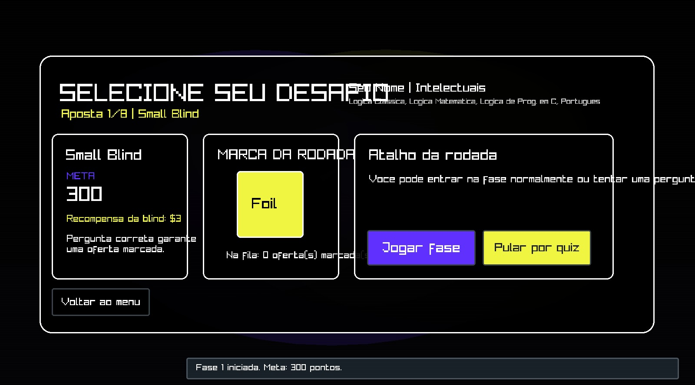

  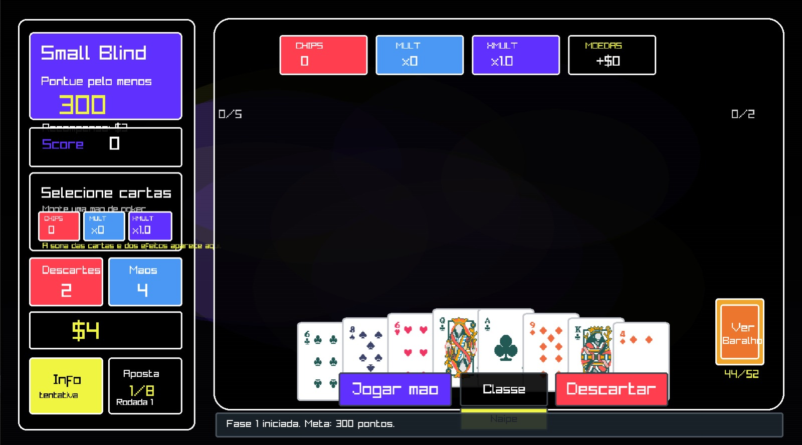

  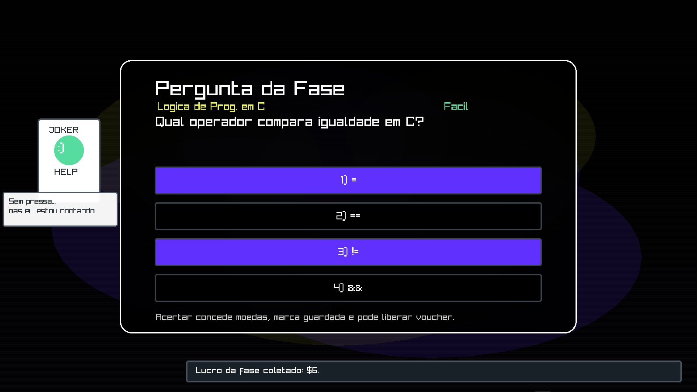

  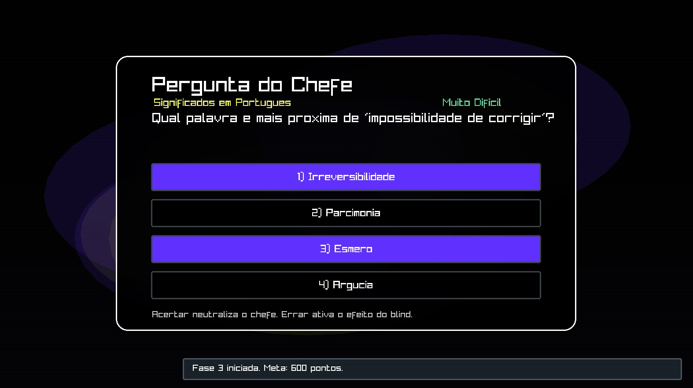

  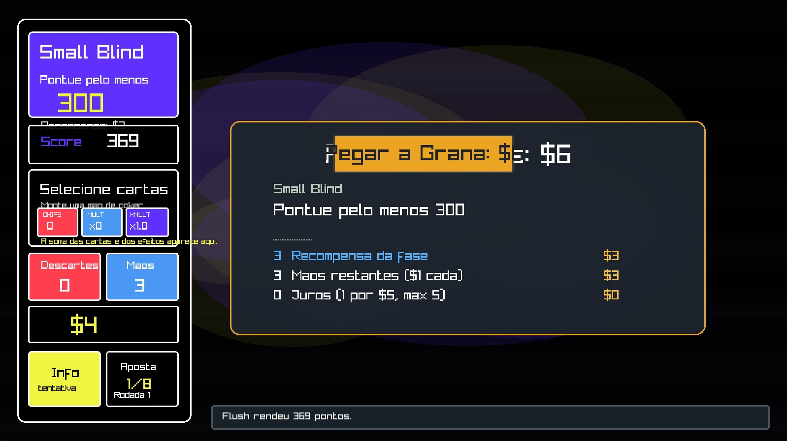

---

### Par 2 — Front-end

| Integrantes | Área de atuação |
| :--- | :--- |
| Mateus Valerino Barros de Santana e Davi Magno Campelo do Nascimento | Interface, telas, feedback visual, loja, coleção e telas finais |

#### Atuação do par

Mateus e Davi atuaram juntos no desenvolvimento visual do jogo.  
Mateus trabalhou principalmente nas telas principais, como **menu inicial, perfil, seleção de desafio, tela da partida, sistema de fases, sistema de moeda e recompensas**.

Davi ficou mais focado nas telas complementares e estratégicas, como **loja, pacotes, coleção, perguntas, Boss, ranking, histórico, run concluída e fim de jogo**.

A dupla precisou manter uma identidade visual parecida em todas as telas, organizando botões, painéis, textos, cartas, mensagens e informações da run.

#### Funcionalidadess relacionadas

| Funcionalidade | Responsável principal |
| :--- | :--- |
| Interface do Início de Partida | Mateus |
| Interface do Sistema de Fases | Mateus |
| Interface do Sistema de Moeda | Mateus |
| Recompensas de Fase | Mateus |
| Sistema de Loja | Davi |
| Sistema de Pacotes | Davi |
| Interface dos Coringas | Davi |
| Interface das Cartas de Tarot | Davi |
| Interface dos Cupons | Davi |
| Feedback Visual | Mateus e Davi |
| Telas finais | Davi |

#### Telas relacionadas

  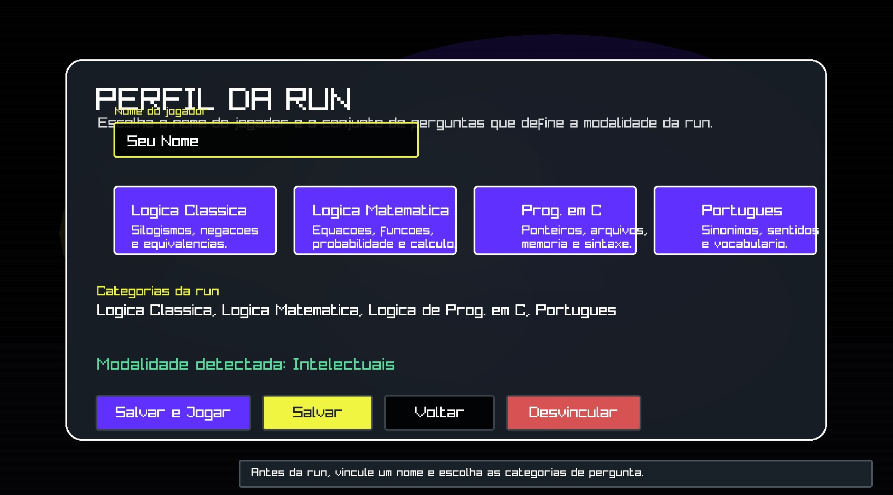

  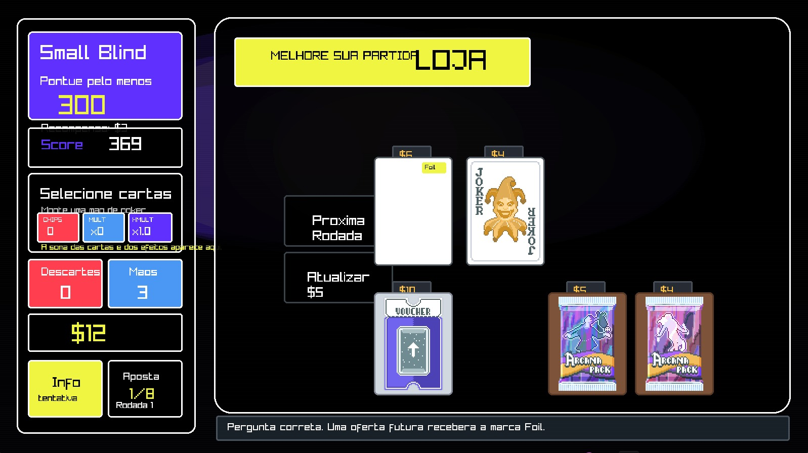

  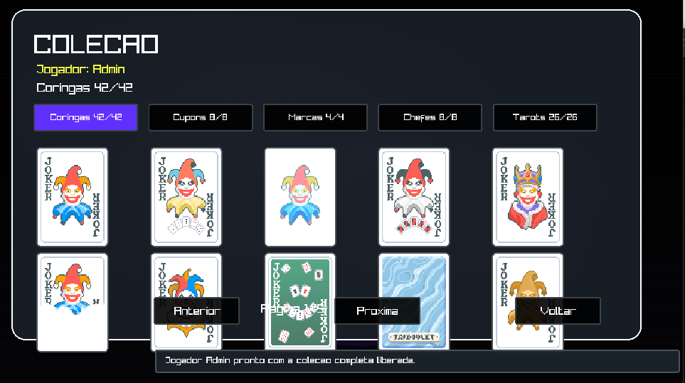

  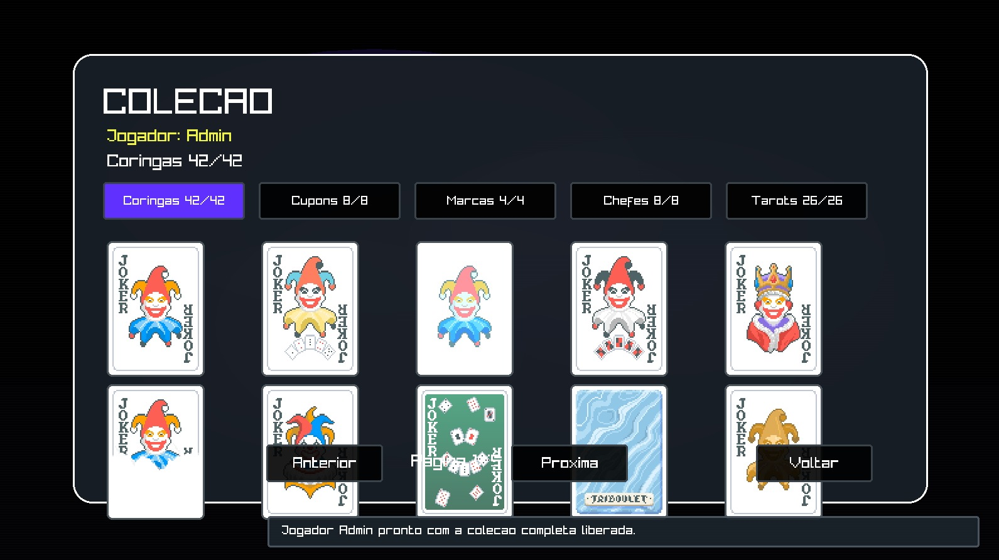

  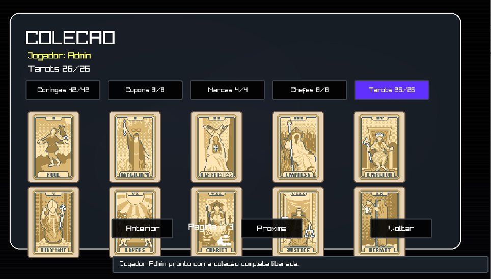

  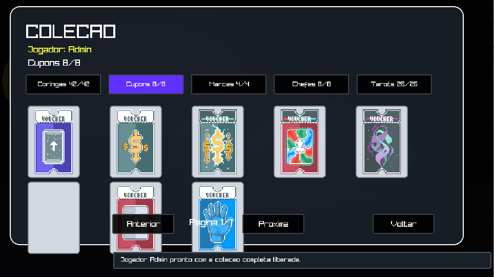

  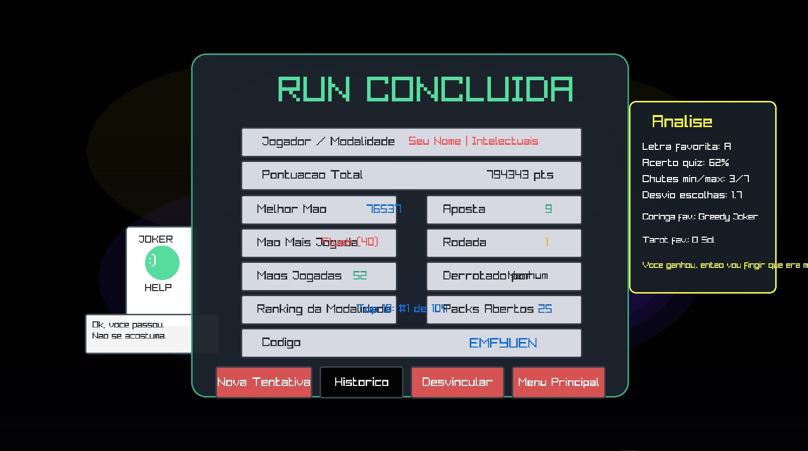

  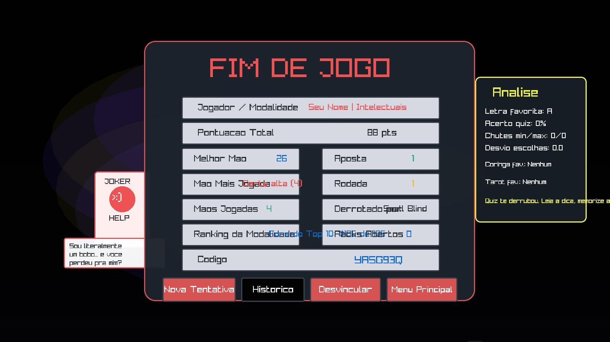

---

### Par 3 — Gestão e Testes

| Integrantes | Área de atuação |
| :--- | :--- |
| Lauan Gonçalves dos Santos e Aquiles Pereira dos Santos | Organização, acompanhamento, testes e validação das funcionalidades |

#### Atuação do par

Lauan e Aquiles atuaram em conjunto na parte de organização e validação do projeto.  
Lauan, como **Scrum Master**, acompanhou as entregas, organizou as tarefas, ajudou na divisão das atividades e auxiliou na preparação das issues e documentação do GitHub.

Aquiles, como **Testes / QA**, validou as funcionalidades implementadas, testando fluxo de telas, botões, mensagens, perguntas, loja, cartas especiais, recompensas e telas finais.

Essa dupla foi importante para verificar se o jogo estava funcionando corretamente e se as telas estavam compreensíveis para o jogador.

#### Funcionalidadess acompanhadas e testadas

| Funcionalidade | Tipo de validação |
| :--- | :--- |
| Início de Partida | Fluxo inicial e vínculo de jogador |
| Sistema de Fases | Avanço entre fases e metas |
| Sistema de Perguntas | Acertos, erros e alternativas |
| BOSS | Pergunta especial e penalidades |
| Sistema de Moeda | Ganho e uso das moedas |
| Sistema de Loja | Compra e atualização de itens |
| Sistema de Pacotes | Exibição e compra |
| Coringas | Visualização e efeitos |
| Cartas de Tarot | Visualização e uso |
| Cupons | Liberação e exibição |
| Recompensas de Fase | Cálculo e tela de pagamento |
| Feedback Visual | Mensagens, telas finais e avisos |

#### Telas analisadas

  

  

  

  

  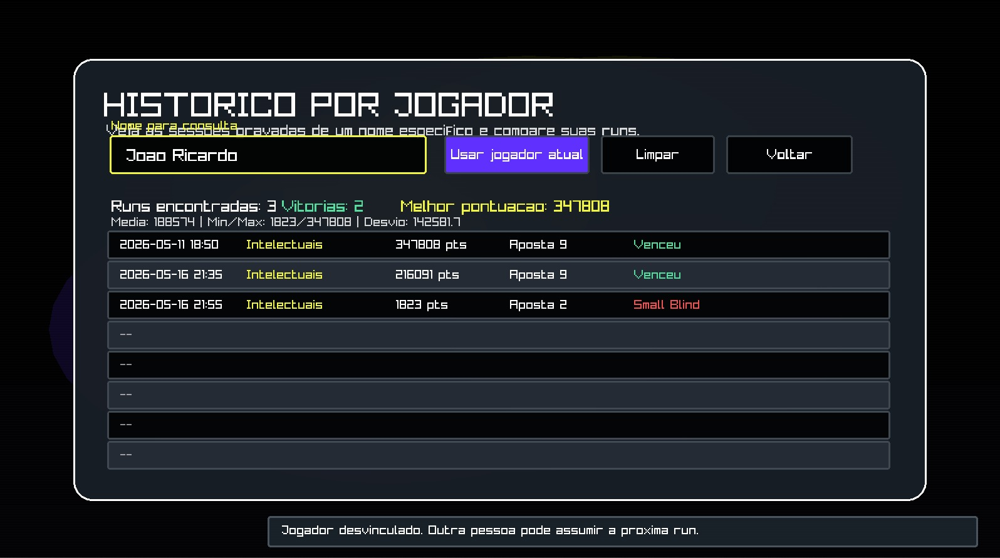

  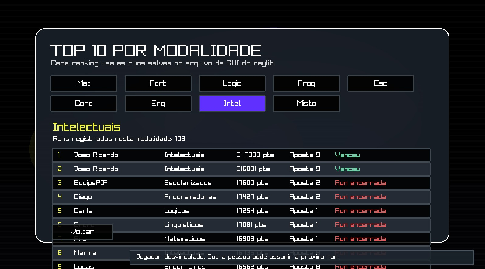

---

### Product Owner — Validação com os pares

| Integrante | Área de atuação |
| :--- | :--- |
| João Ricardo Alves de Brito | Validação do produto e experiência do jogador |

#### Atuação com os pares

João Ricardo atuou em ligação com todos os pares da equipe.  
Como **Product Owner**, ele validou se as funcionalidades faziam sentido dentro da proposta do jogo e se o MetaDeck mantinha sua ideia principal: unir **cartas, estratégia e perguntas educacionais**.

Com o par de back-end, João acompanhou a lógica de fases, perguntas, Boss, moedas e cartas especiais.  
Com o par de front-end, validou se as telas estavam claras e se o jogador conseguia entender as informações apresentadas.  
Com o par de gestão e QA, acompanhou os testes e ajudou a priorizar melhorias.

#### Funcionalidadess validadas

| Funcionalidade | Validação realizada |
| :--- | :--- |
| Início de Partida | Clareza do menu e fluxo inicial |
| Sistema de Fases | Progressão da run |
| Sistema de Perguntas | Relação com o objetivo educacional |
| BOSS | Dificuldade e desafio especial |
| Sistema de Moeda | Uso estratégico na loja |
| Sistema de Loja | Utilidade dos itens |
| Sistema de Pacotes | Vantagem para a run |
| Coringas | Estratégia e efeito na partida |
| Cartas de Tarot | Efeito especial e clareza |
| Cupons | Benefícios e progressão |
| Recompensas de Fase | Entendimento do jogador |
| Feedback Visual | Clareza das mensagens e telas finais |

#### Telas validadas

  

  

  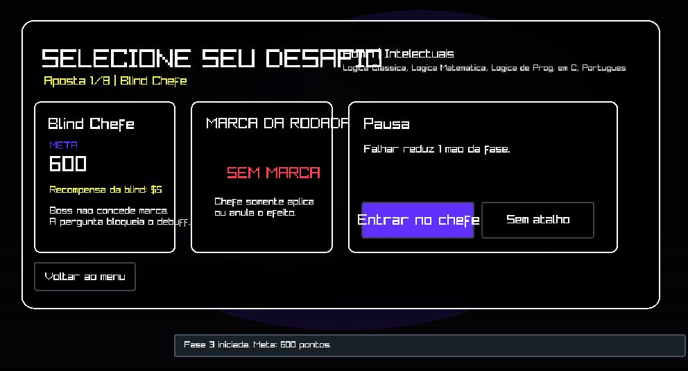

  

  

---

## Equipe

A equipe do **MetaDeck** foi organizada de forma colaborativa, distribuindo responsabilidades entre planejamento, prototipação, desenvolvimento, testes e apoio à documentação do projeto.

<table>
  <thead>
    <tr>
      <th>Foto</th>
      <th>Integrante</th>
      <th>Função</th>
      <th>Descrição</th>
    </tr>
  </thead>
  <tbody>
    <tr>
      <td align="center">
        
      </td>
      <td><strong>Ewerton Guilherme da Silva</strong></td>
      <td><strong>Desenvolvedor Back-end</strong></td>
      <td>Atuação no planejamento do projeto, organização das ideias principais e contribuição nas decisões relacionadas à estrutura e desenvolvimento do sistema.</td>
    </tr>
    <tr>
      <td align="center">
        
      </td>
      <td><strong>Lauan Gonçalves dos Santos</strong></td>
      <td><strong>Scrum Master</strong></td>
      <td>Responsável pelo apoio à organização visual do projeto, prototipação das telas e representação dos fluxos e interfaces do jogo.</td>
    </tr>
    <tr>
      <td align="center">
        
      </td>
      <td><strong>Davi Magno Campelo do Nascimento</strong></td>
      <td><strong>Desenvolvedor Front-end</strong></td>
      <td>Contribuiu com a construção das interações visíveis ao jogador, organização dos menus, mensagens e navegação do sistema.</td>
    </tr>
    <tr>
      <td align="center">
        
      </td>
      <td><strong>Aquiles Pereira dos Santos</strong></td>
      <td><strong>Testes / QA</strong></td>
      <td>Responsável pela validação das funcionalidades, testes do sistema e verificação do comportamento esperado das mecânicas implementadas.</td>
    </tr>
    <tr>
      <td align="center">
        
      </td>
      <td><strong>João Ricardo Alves de Brito</strong></td>
      <td><strong>Product Owner</strong></td>
      <td>Atuação no apoio à lógica interna da aplicação, organização de dados, regras do sistema e funcionamento das principais mecânicas.</td>
    </tr>
    <tr>
      <td align="center">
        
      </td>
      <td><strong>Mateus Valerino Barros de Santana</strong></td>
      <td><strong>Desenvolvedor Front-end</strong></td>
      <td>Contribuiu com a construção das telas, apresentação das informações ao jogador e melhoria da experiência durante a execução do jogo.</td>
    </tr>
    <tr>
      <td align="center">
        
      </td>
      <td><strong>Lucas Aprígio dos Santos</strong></td>
      <td><strong>Desenvolvedor Back-end</strong></td>
      <td>Apoio na implementação das funcionalidades internas do sistema, estrutura de suporte da aplicação e organização do funcionamento geral do projeto.</td>
    </tr>
  </tbody>
</table>

---

